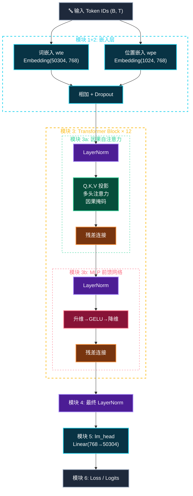

```mermaid
flowchart LR
    X["输入 x\n(B,T,768)"]
    LN["LayerNorm"]
    PROJ["c_attn\nLinear(768→2304)"]
    SPLIT["split → Q, K, V\n各 (B,12,T,64)"]
    SCORE["Q·Kᵀ / √64\n(B,12,T,T)"]
    MASK["因果掩码\n下三角"]
    SOFT["softmax + dropout"]
    OUT["att @ V\n(B,T,768)"]
    CP["c_proj\nLinear(768→768)\n+ dropout"]
    RES["+ 残差"]

    X --> LN --> PROJ --> SPLIT --> SCORE --> MASK --> SOFT --> OUT --> CP --> RES
    X -.-> RES

    style X fill:#1e293b,stroke:#94a3b8,color:#fff,stroke-width:1.5px
    style LN fill:#4c1d95,stroke:#a78bfa,color:#fff,stroke-width:1.5px
    style PROJ fill:#064e3b,stroke:#34d399,color:#fff,stroke-width:1.5px
    style SPLIT fill:#064e3b,stroke:#34d399,color:#fff,stroke-width:1.5px
    style SCORE fill:#064e3b,stroke:#34d399,color:#fff,stroke-width:1.5px
    style MASK fill:#78350f,stroke:#fb923c,color:#fff,stroke-width:1.5px
    style SOFT fill:#064e3b,stroke:#34d399,color:#fff,stroke-width:1.5px
    style OUT fill:#064e3b,stroke:#34d399,color:#fff,stroke-width:1.5px
    style CP fill:#064e3b,stroke:#34d399,color:#fff,stroke-width:1.5px
    style RES fill:#78350f,stroke:#fb923c,color:#fff,stroke-width:1.5px
```

# 02 架构：GPT 模型分模块详解

> 📊 额外架构图（浏览器打开）：[Mermaid HTML 版](./gpt_architecture_mermaid.html) · [SVG 手绘版](./gpt_architecture.html)

## 全局架构总览

GPT 由 **6 个模块** 组成，数据从上往下流：

```
模块 1: Token Embedding  ──┐
模块 2: Position Embedding ─┤相加
                            ▼
模块 3: Transformer Block × N ──→ (内部含 模块3a: Attention + 模块3b: MLP)
                            ▼
模块 4: LayerNorm (最终)
模块 5: LM Head (输出层)
模块 6: Loss 计算 (训练时)
```



---

## 模块 1: Token Embedding（词嵌入）

**作用**：把整数 id 变成向量。模型不认识数字 42，但认识一个 768 维的向量。

| 项目 | 值 |
|------|-----|
| 输入 | `(B, T)` 整数张量，每个元素是一个 token id |
| 输出 | `(B, T, 768)` 浮点张量，每个 token 变成 768 维向量 |
| 参数 | `nn.Embedding(50304, 768)` — 一张 50304 × 768 的查找表 |
| 源码 | `self.transformer.wte = nn.Embedding(config.vocab_size, config.n_embd)` |

```python
tok_emb = self.transformer.wte(idx)  # (B, T) → (B, T, 768)
```

**类比**：像一本字典，翻到第 42 页，读出一个 768 维的向量。这个词向量是**可学习的**——训练过程中不断调整，让意思相近的词拥有相近的向量。

---

## 模块 2: Position Embedding（位置嵌入）

**作用**：告诉模型"这个 token 在序列的第几位"。Attention 本身不区分顺序，必须额外注入位置信息。

| 项目 | 值 |
|------|-----|
| 输入 | `torch.arange(0, T)` — 位置 id `[0, 1, 2, ..., T-1]` |
| 输出 | `(T, 768)` — 每个位置一个 768 维向量 |
| 参数 | `nn.Embedding(1024, 768)` — 最多编码 1024 个位置 |
| 源码 | `self.transformer.wpe = nn.Embedding(config.block_size, config.n_embd)` |

```python
pos = torch.arange(0, T, device=device)   # [0, 1, 2, ..., T-1]
pos_emb = self.transformer.wpe(pos)        # (T, 768)
```

**模块 1+2 合并**：两个嵌入逐元素相加，再过 Dropout：
```python
x = self.transformer.drop(tok_emb + pos_emb)   # (B, T, 768)
```

> **weight tying（权重绑定）**：`transformer.wte.weight = lm_head.weight`。输入嵌入和输出层共享同一份权重矩阵，节省约 3000 万参数，效果还更好。

---

## 模块 3a: CausalSelfAttention（因果自注意力）

**作用**：让每个 token "看"它左边所有 token，加权汇总上下文信息。这是 Transformer 最核心的操作。

| 项目 | 值 |
|------|-----|
| 输入 | `(B, T, 768)` |
| 输出 | `(B, T, 768)` |
| 核心参数 | `c_attn`: Linear(768, 2304) 投影出 Q,K,V |
| | `c_proj`: Linear(768, 768) 输出投影 |
| 因果掩码 | 下三角矩阵，位置 i 只能看 ≤i 的位置 |
| 源码 | `self.transformer.h[i].attn` |

### 子结构



### 核心代码

```python
# 1. 投影出 Q, K, V（拼成一个大矩阵再切）
q, k, v = self.c_attn(x).split(self.n_embd, dim=2)   # 各 (B, T, 768)

# 2. 拆成 12 个头，每头 64 维
q = q.view(B, T, 12, 64).transpose(1, 2)   # (B, 12, T, 64)
k = k.view(B, T, 12, 64).transpose(1, 2)
v = v.view(B, T, 12, 64).transpose(1, 2)

# 3. 注意力分数 + 因果掩码 + softmax
att = (q @ k.transpose(-2, -1)) / math.sqrt(64)   # (B, 12, T, T)
att = att.masked_fill(causal_mask == 0, -inf)      # 屏蔽未来
att = softmax(att, dim=-1)
att = dropout(att)

# 4. 加权汇总 V，拼回 768 维
y = att @ v                        # (B, 12, T, 64)
y = y.transpose(1,2).view(B, T, 768)
y = self.c_proj(y)                 # 输出投影
y = dropout(y)
```

### 多头注意力的意义

把 768 维拆成 **12 个头，每头 64 维**，各自独立算注意力：
- 不同的头可以关注不同类型的关系（语法、语义、位置等）
- 最后拼接起来，相当于"综合多种视角"

### Flash Attention（PyTorch ≥2.0）
```python
y = F.scaled_dot_product_attention(q, k, v, is_causal=True)
```
一行代码替代上面的手动计算，CUDA 内核融合，更快更省显存。

---

## 模块 3b: MLP（前馈网络）

**作用**：对每个 token 独立做非线性变换。**存储事实知识**的主要模块。

| 项目 | 值 |
|------|-----|
| 输入 | `(B, T, 768)` |
| 输出 | `(B, T, 768)` |
| 参数 | `c_fc`: Linear(768, 3072) 升维 |
| | `c_proj`: Linear(3072, 768) 降维 |
| 与 Attention 区别 | 不跨位置，每个 token 独立计算 |
| 源码 | `self.transformer.h[i].mlp` |

### 子结构


### 核心代码

```python
x = self.c_fc(x)     # (B,T,768) → (B,T,3072)  升维4倍
x = self.gelu(x)     # GELU 激活（比 ReLU 更平滑）
x = self.c_proj(x)   # (B,T,3072) → (B,T,768)  降维回原
x = self.dropout(x)
```

### 三个关键作用

1. **知识存储**：MLP 权重里编码了大量事实知识（如"巴黎是法国首都"）
2. **非线性**：GELU 引入非线性，让模型能学复杂规律（纯 Attention 是线性的）
3. **升维→压缩**：768→3072→768，先展开到高维空间做变换，再压回来

---

## 模块 3: Transformer Block（组合模块）

**作用**：把 3a 和 3b 组装起来，重复 N 次。

```python
def forward(self, x):
    x = x + self.attn(self.ln_1(x))   # 模块3a：PreLN + 注意力 + 残差
    x = x + self.mlp(self.ln_2(x))    # 模块3b：PreLN + MLP + 残差
    return x
```

### Pre-LN vs Post-LN

GPT-2 用 **Pre-LayerNorm**（先归一化再进子层），比原始 Transformer 的 Post-LN 更稳定，训练更深的网络不容易梯度消失。

### 残差连接 `x + sublayer(x)`

- 保留原始信息（"即使子层什么都没学到，信息也不会丢"）
- 梯度直接流过（解决深层网络梯度消失）
- 允许叠 12 层甚至 48 层

---

## 模块 4: 最终 LayerNorm（ln_f）

**作用**：Block 堆完后的最后一次归一化，稳定输出数值范围。

```python
x = self.transformer.ln_f(x)   # (B, T, 768) → (B, T, 768)
```

自定义 `LayerNorm(768, bias=config.bias)`，和 Block 内的 LN 相同。

---

## 模块 5: LM Head（语言模型头）

**作用**：把 768 维向量映射回词表大小，得到每个位置对所有词的"打分"（logits）。

```python
logits = self.lm_head(x)   # (B, T, 768) → (B, T, 50304)
```

| 项目 | 值 |
|------|-----|
| 参数 | `nn.Linear(768, 50304, bias=False)` |
| weight tying | 权重与模块 1 的 `wte` 共享 |
| `bias=False` | 因为 Embedding 没有 bias，绑定的 lm_head 也不能有 |

---

## 模块 6: Loss 计算（训练时）

**作用**：比较模型预测和真实标签，算出 loss 用于反向传播。

```python
# 训练时：对所有位置算 loss
loss = F.cross_entropy(
    logits.view(-1, 50304),    # 展平成 (B*T, V)
    targets.view(-1),           # 展平成 (B*T,)
    ignore_index=-1             # 忽略 padding 位置
)

# 推理时：只取最后一个位置的 logits，不算 loss
logits = self.lm_head(x[:, [-1], :])   # (B, 1, 50304)
loss = None
```

---

## 常见问题

- **Q：n_head 和 n_embd 什么关系？** `n_embd % n_head == 0`，每头 `768/12=64` 维
- **Q：为什么需要位置嵌入？** Attention 本身不区分顺序
- **Q：残差连接作用？** 梯度直通 + 保留原始信息
- **Q：MLP 和 Attention 的区别？** Attention 跨位置收集信息，MLP 每个位置独立处理
- **Q：weight tying 为什么有效？** 减少参数 + 语义一致性（"输入"和"输出"共享同一语义空间）