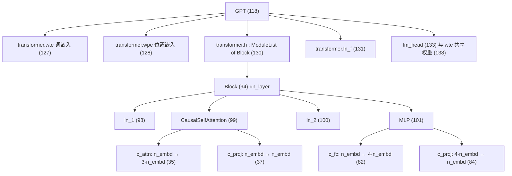

# 05 源码解读：`model.py`（330 行，GPT 的全部定义）

> 一句话：`model.py` 用 5 个 `nn.Module`（`LayerNorm` → `CausalSelfAttention` → `MLP` → `Block` → `GPT`）**自下而上**堆出 GPT，外加 1 个 `GPTConfig` dataclass（共 6 个类）。
> 文件里没有训练、没有数据、没有 IO；给它一个 `(B, T)` 的整数张量：训练时（传了 `targets`）返回 `(B, T, vocab)` 的 logits + loss，推理时只对最后一个位置算 lm_head，返回 `(B, 1, vocab)` 的 logits。

## 类与行号地图

| 行号 | 对象 | 作用 |
|------|------|------|
| `model.py:18` | `LayerNorm` | 自定义 LayerNorm，支持 `bias=False`（源码注释称"PyTorch 原生不支持"，实为历史写法） |
| `model.py:29` | `CausalSelfAttention` | 多头因果自注意力（Flash / 手写两条路） |
| `model.py:78` | `MLP` | 前馈网络，4 倍升维 + GELU |
| `model.py:94` | `Block` | 一个 Transformer 层 = LN+Attn+残差, LN+MLP+残差 |
| `model.py:108-109` | `GPTConfig` | dataclass（`@dataclass` 在 108、`class GPTConfig` 在 109），7 个超参（唯一"配置"来源） |
| `model.py:118` | `GPT` | 顶层：embedding → N 个 Block → LN → lm_head，以及生成/优化器/MFU |



## 1. `LayerNorm`（`model.py:18-27`）

```python
class LayerNorm(nn.Module):
    """ LayerNorm but with an optional bias. PyTorch doesn't support simply bias=False """

    def __init__(self, ndim, bias):
        super().__init__()
        self.weight = nn.Parameter(torch.ones(ndim))
        self.bias = nn.Parameter(torch.zeros(ndim)) if bias else None

    def forward(self, input):
        return F.layer_norm(input, self.weight.shape, self.weight, self.bias, 1e-5)
```

- 为什么要自己写：源码注释原文写着 `PyTorch doesn't support simply bias=False`——`nn.LayerNorm` 只能选择 `elementwise_affine=True/False`，做不到"有 weight、没有 bias"。`bias=False` 更省显存也略快，所以这里自己包一层。（补充：PyTorch ≥ 2.1 的 `nn.LayerNorm` 已支持 `bias=False`，这段是历史写法，结果等价。）
- `bias=False` 时 `self.bias is None`，`F.layer_norm` 收到 `None` 就跳过偏移项。**参数表里会少掉一堆 1D 参数**（见下方实测）。
- `eps=1e-5` 是硬编码的（GPT-2 默认）——不是 1e-6。

## 2. `CausalSelfAttention`（`model.py:29-76`）

### `__init__`

```python
assert config.n_embd % config.n_head == 0
# key, query, value projections for all heads, but in a batch
self.c_attn = nn.Linear(config.n_embd, 3 * config.n_embd, bias=config.bias)
# output projection
self.c_proj = nn.Linear(config.n_embd, config.n_embd, bias=config.bias)
self.attn_dropout = nn.Dropout(config.dropout)
self.resid_dropout = nn.Dropout(config.dropout)
self.n_head = config.n_head
self.n_embd = config.n_embd
self.dropout = config.dropout
# flash attention make GPU go brrrrr but support is only in PyTorch >= 2.0
self.flash = hasattr(torch.nn.functional, 'scaled_dot_product_attention')
if not self.flash:
    print("WARNING: using slow attention. Flash Attention requires PyTorch >= 2.0")
    self.register_buffer("bias", torch.tril(torch.ones(config.block_size, config.block_size))
                                .view(1, 1, config.block_size, config.block_size))
```

- **Q/K/V 一次性投影**：一个 `c_attn` 从 `n_embd` 到 `3*n_embd`，比三个独立 Linear 更快（一次矩阵乘）。
- `self.flash` 是 Python 属性（不可训练参数），只是运行时的能力探测；旧版 PyTorch 才需要那个下三角 mask buffer（`register_buffer` → 会进 `state_dict`，所以 `from_pretrained` 里要把它过滤掉，见后文）。
- 注意两个 dropout：`attn_dropout` 只在手写路径用，`resid_dropout` 两条路都用。

### `forward`：形状是怎么走的

```python
B, T, C = x.size() # batch size, sequence length, embedding dimensionality (n_embd)
q, k, v  = self.c_attn(x).split(self.n_embd, dim=2)
k = k.view(B, T, self.n_head, C // self.n_head).transpose(1, 2) # (B, nh, T, hs)
```

以红楼梦配置（`batch_size=64, block_size=256, n_embd=384, n_head=6`）为例：

| 张量 | 形状 | 含义 |
|------|------|------|
| `x` | `(64, 256, 384)` | batch / 上下文长度 / 每字符 384 维 |
| `self.c_attn(x)` | `(64, 256, 1152)` | Q\||K\||V 拼在一起 |
| `q,k,v` | 各 `(64, 256, 384)` | `split(384, dim=2)` 切三份 |
| `k,q,v` 变形后 | `(64, 6, 256, 64)` | 6 个头 × 每头 64 维 → 头放在 batch 维后面 |
| `att`（`q @ kᵀ`） | `(64, 6, 256, 256)` | 每个头一张"谁看谁"的分数表 |
| `y` | `(64, 6, 256, 64)` → view → `(64, 256, 384)` | 头输出拼回 384 维 |

```python
if self.flash:
    y = torch.nn.functional.scaled_dot_product_attention(q, k, v, attn_mask=None, dropout_p=self.dropout if self.training else 0, is_causal=True)
else:
    att = (q @ k.transpose(-2, -1)) * (1.0 / math.sqrt(k.size(-1)))
    att = att.masked_fill(self.bias[:,:,:T,:T] == 0, float('-inf'))
    att = F.softmax(att, dim=-1)
    att = self.attn_dropout(att)
    y = att @ v
```

- 两段是**数学上等价**的：Flash 那条用 CUDA 内核融合，分块计算，**不把 `(B,nh,T,T)` 注意力矩阵写回显存（HBM）**——块留在片上高速缓存里，所以又快又省显存；手写那条必须把这个大矩阵完整算出来、写进显存再读回来。
- `1.0/math.sqrt(hs)` 是缩放因子（`hs=64` → ÷8），防止点积数值过大把 softmax 推平。
- `masked_fill(..., -inf)` 让第 t 个位置只能看 ≤ t 的位置（因果/自回归）——这是 GPT（自回归）与 BERT（双向）在注意力层最本质的结构差别。
- `is_causal=True` 是 Flash 版的等价开关；`dropout_p` 在评测时（`self.training == False`）归零，所以 `model.eval()` 之后输出确定。
- 最后 `y.transpose(1, 2).contiguous().view(B, T, C)`：`.contiguous()` 是必须的，否则 `view` 会报错（transpose 后内存不连续）。

## 3. `MLP`（`model.py:78-92`）

```python
self.c_fc    = nn.Linear(config.n_embd, 4 * config.n_embd, bias=config.bias)
self.gelu    = nn.GELU()
self.c_proj  = nn.Linear(4 * config.n_embd, config.n_embd, bias=config.bias)
```

升维 4 倍再降回来（`384 → 1536 → 384`），逐位置独立作用，无跨位置信息交换——**"跨位置"只发生在 Attention 里，MLP 只是每个位置自己算**。4× 是 GPT-2 的约定。

## 4. `Block`（`model.py:94-106`）

```python
def forward(self, x):
    x = x + self.attn(self.ln_1(x))
    x = x + self.mlp(self.ln_2(x))
    return x
```

Pre-LN 结构：LayerNorm 在子层**之前**，两条残差相加。残差是"梯度高速公路"，让 12 层甚至更深的网络能训起来。注意 LN 作用在残差主干之外（不进主干），所以主干是一条干净的 `x += ...` 链。

## 5. `GPTConfig`（`model.py:108-116`）

```python
@dataclass
class GPTConfig:
    block_size: int = 1024
    vocab_size: int = 50304 # GPT-2 vocab_size of 50257, padded up to nearest multiple of 64 for efficiency
    n_layer: int = 12
    n_head: int = 12
    n_embd: int = 768
    dropout: float = 0.0
    bias: bool = True # True: bias in Linears and LayerNorms, like GPT-2. False: a bit better and faster
```

- `vocab_size=50304`：GPT-2 真实词表 50257，向上取到 64 的倍数方便 GPU 对齐（多出来的 47 行是 padding：训练时永远不会成为 target，但仍占一点显存，而且 `generate()` 是对完整词表做 softmax，理论上仍有被采样到的可能）。
- 这是全文件唯一的配置对象；`train.py` 用它兜住所有超参，然后存进 ckpt 的 `model_args`。
- 注意这里是**类默认值**，`train.py` 的命令行默认值是另一套（`bias=False` 等），实际以 train.py 为准。

## 6. `GPT`（`model.py:118-330`）

### `__init__`：组装 + 权重绑定 + 初始化

```python
self.transformer = nn.ModuleDict(dict(
    wte = nn.Embedding(config.vocab_size, config.n_embd),
    wpe = nn.Embedding(config.block_size, config.n_embd),
    drop = nn.Dropout(config.dropout),
    h = nn.ModuleList([Block(config) for _ in range(config.n_layer)]),
    ln_f = LayerNorm(config.n_embd, bias=config.bias),
))
self.lm_head = nn.Linear(config.n_embd, config.vocab_size, bias=False)
self.transformer.wte.weight = self.lm_head.weight # https://paperswithcode.com/method/weight-tying
```

- `wte/pos`：`wte` 是"字符 id → 向量"，`wpe` 是"位置 id → 向量"，两者直接相加（`model.py:179`）。
- **权重绑定（weight tying）**：`wte.weight` 和 `lm_head.weight` 指向**同一个 Parameter 对象**。词表矩阵 `4339×384` 只存一份，参数计数也只算一次。副作用：改其中一个会同时改另一个（训练时梯度叠加）。
- `lm_head` 没有 bias（GPT-2 的做法）。

```python
self.apply(self._init_weights)                      # 所有 Linear/Embedding: N(0, 0.02)
for pn, p in self.named_parameters():
    if pn.endswith('c_proj.weight'):
        torch.nn.init.normal_(p, mean=0.0, std=0.02/math.sqrt(2 * config.n_layer))
```

- `_init_weights`（`model.py:162`）：Linear 权重 `N(0, 0.02)`、bias 置 0；Embedding `N(0, 0.02)`。
- 残差投影 `c_proj` 额外缩小到 `0.02/√(2·n_layer)`——GPT-2 论文的缩放初始化，防止残差累加把方差越堆越大（`2` 因为每个 Block 有两条残差）。

### `get_num_params`（`model.py:150-160`）

```python
n_params = sum(p.numel() for p in self.parameters())
if non_embedding:
    n_params -= self.transformer.wpe.weight.numel()
```

只减 `wpe`（位置嵌入），**不减 `wte`**：因为 `wte` 与 `lm_head` 共享，它其实是最后一层的权重，算"非嵌入参数"时理应计入。这就是日志里 `number of parameters: 12.29M` 比实际参数总数（12.386M）少 98,304 的原因——差值正好是 `wpe` 的 `256×384`。（12.386M 是**参数个数**；张量一共 39 个。）

### `forward`（`model.py:170-193`）

```python
tok_emb = self.transformer.wte(idx) # (b, t, n_embd)
pos_emb = self.transformer.wpe(pos) # (t, n_embd)
x = self.transformer.drop(tok_emb + pos_emb)
for block in self.transformer.h:
    x = block(x)
x = self.transformer.ln_f(x)

if targets is not None:
    logits = self.lm_head(x)
    loss = F.cross_entropy(logits.view(-1, logits.size(-1)), targets.view(-1), ignore_index=-1)
else:
    logits = self.lm_head(x[:, [-1], :]) # note: using list [-1] to preserve the time dim
    loss = None
```

- `assert t <= block_size`：超长序列会直接报错，不会静默截断。
- 训练时：`(B,T,vocab)` 的 logits 拉平成 `(B*T, vocab)`，和同样拉平的 targets 逐位置算交叉熵；`ignore_index=-1` 允许把某些位置标成 -1 来屏蔽（nanoGPT 自己不用，留给使用者）。
- 推理时：**只算最后一个位置的 logits**（`x[:, [-1], :]`，用列表索引保住 T 维），前面的位置没人要，省一大截算力。这就是"生成慢"的根源：一次前向只多产出一个 token。
- loss 的口径：这是**一个 batch 内 B·T 个位置的平均交叉熵**，不是整段文本的；`train.py` 里为了梯度累积还会再除以 `gradient_accumulation_steps`。

### `crop_block_size`（`model.py:195-204`）

加载 GPT-2（`block_size=1024`）后想用更短的上下文时调用：把 `wpe` 裁掉尾部，并把注意力 mask 裁小。只在"加载预训练权重 + 想要小模型"时用；从零训练不需要。

### `from_pretrained`（`model.py:206-261`）

把 HuggingFace 的 GPT-2 权重搬进 nanoGPT：

| 模型 | `n_layer/n_head/n_embd` | 参数量 |
|------|------------------------|--------|
| `gpt2` | 12/12/768 | 124M |
| `gpt2-medium` | 24/16/1024 | 350M |
| `gpt2-large` | 36/20/1280 | 774M |
| `gpt2-xl` | 48/25/1600 | 1558M |

关键细节：
- 强制 `vocab_size=50257, block_size=1024, bias=True`（前缀里的注释：`always ... for GPT model checkpoints`）。
- HF 侧过滤掉 `.attn.masked_bias` / `.attn.bias` 两个 buffer（不是参数，nanoGPT 这边只在没 Flash 时才注册 `bias`）。
- `transposed = ['attn.c_attn.weight', 'attn.c_proj.weight', 'mlp.c_fc.weight', 'mlp.c_proj.weight']`：OpenAI/HF 用的是 `Conv1D`（权重形状反过来），必须 `.t()` 转置后再 `copy_`。
- 只允许覆盖 `dropout`（`model.py:211` 的 assert）。

### `configure_optimizers`（`model.py:263-287`）

```python
decay_params = [p for n, p in param_dict.items() if p.dim() >= 2]
nodecay_params = [p for n, p in param_dict.items() if p.dim() < 2]
```

**规则：维度 ≥ 2 的参数做 weight decay，< 2 的不做。** 直觉是：矩阵乘权重和嵌入表"衰减一下更稳"，而 bias / LayerNorm 的缩放参数衰减会伤害表达力。然后创建 AdamW，并探测 `fused` 内核（只有 CUDA 且有 fused 实现时才用）：

```python
fused_available = 'fused' in inspect.signature(torch.optim.AdamW).parameters
use_fused = fused_available and device_type == 'cuda'
```

### `estimate_mfu`（`model.py:289-303`）

按 PaLM 论文附录 B 的公式估算"算力利用率"：

```python
N = self.get_num_params()
cfg = self.config
L, H, Q, T = cfg.n_layer, cfg.n_head, cfg.n_embd//cfg.n_head, cfg.block_size
flops_per_token = 6*N + 12*L*H*Q*T
flops_per_fwdbwd = flops_per_token * T
flops_per_iter = flops_per_fwdbwd * fwdbwd_per_iter
flops_achieved = flops_per_iter * (1.0/dt) # per second
flops_promised = 312e12 # A100 GPU bfloat16 peak flops is 312 TFLOPS
```

- `N` 就是 `get_num_params()` 的返回值（**12.29M 那个口径**，已扣掉 `wpe`），不是参数量总数。

- `6N` = 前向 2N + 反向 4N；`12·L·H·Q·T` 是注意力那部分（`Q = n_embd/n_head`，`T = block_size`）。
- **基准是 A100 的 312 TFLOPS**，所以在 3070 Ti 上算出来的 MFU 只是"相对 A100 的比率"，不是本卡利用率。日志里的 `mfu` 从 5.57%（iter 10）总体降到 3.41%（iter 5000，全程最低 3.33% 出现在 iter 4500），说的都是"相当于 A100 峰值的百分之几"，别当成显卡跑不动了。

### `generate`（`model.py:305-330`）

```python
@torch.no_grad()
def generate(self, idx, max_new_tokens, temperature=1.0, top_k=None):
    for _ in range(max_new_tokens):
        idx_cond = idx if idx.size(1) <= self.config.block_size else idx[:, -self.config.block_size:]
        logits, _ = self(idx_cond)
        logits = logits[:, -1, :] / temperature
        if top_k is not None:
            v, _ = torch.topk(logits, min(top_k, logits.size(-1)))
            logits[logits < v[:, [-1]]] = -float('Inf')
        probs = F.softmax(logits, dim=-1)
        idx_next = torch.multinomial(probs, num_samples=1)
        idx = torch.cat((idx, idx_next), dim=1)
    return idx
```

逐行就是"自回归采样"的教科书流程：**裁上下文 → 前向 → 取最后一步 logits → 除温度 → top-k 截断 → softmax → 按概率抽一个 → 拼回序列**。
- `@torch.no_grad()` 关掉反向图，省显存也更快。
- 注意每次循环都重算整个前缀（KV Cache 的优化点在 nanoGPT 里没有），所以成本随生成长度线性增长。
- 详细解释见 [`04_推理.md`](./04_推理.md)。

## 实测：本仓库真的跑过这套代码

我用日志 `logs/train-20260918-131745.log`（配置 `config/train_hongloumeng_char.py`，`--device=cuda --compile=False`）对了一遍参数量，同时用公式独立复算：

| 组成 | 张量数 | 参数量（红楼梦配置：`n_layer=6, n_embd=384, block_size=256, vocab=4339, bias=False`） |
|------|--------|------|
| `wte`（与 `lm_head` 共享，只算一次） | 1 | 1,666,176 |
| `wpe` | 1 | 98,304 |
| 6 个 Block（每个 `12·n_embd² = 1,769,472`） | 24 | 10,616,832 |
| LayerNorm 的 weight（`ln_1/ln_2`×6 + `ln_f`，无 bias） | 13 | 4,992 |
| **合计** | **39** | **12,386,304（12.39M）** |

日志原文完全吻合：`number of parameters: 12.29M`（= 12,386,304 − 98,304，即 `get_num_params()` 扣掉 `wpe`）、`num decayed parameter tensors: 26, with 12,381,312 parameters`（= 1,666,176 + 10,616,832 + 98,304... 注意 **`wpe` 因为是 2D 也进 decay 组**，所以 decayed 组 = 12,381,312 = 12,386,304 − 4,992 ✓）、`num non-decayed parameter tensors: 13, with 4,992 parameters`（正好 13 个 LayerNorm weight ✓）。

同样架构换成 `shakespeare_char`（`vocab=65`）只有 10.75M；`train.py` 默认那套（12L/12H/768d/block1024/vocab50304）是 124.37M（这两个数按**参数总数**口径；按 `get_num_params()` 口径分别是 10.65M / 123.59M）。**差异几乎全部来自 `wte`** ——中文 4339 字符的表比英文 65 个字符的表多 164 万参数。

## 自测 Q&A

1. `wte` 和 `lm_head` 是同一个 Parameter，那它的梯度是哪来的？→ 前向里它被用了两次（输入嵌入 + 输出投影），反向时两个来源的梯度累加到同一个 `.grad` 上。
2. 为什么 `get_num_params()` 只扣 `wpe` 不扣 `wte`？→ `wte` 同时充当最后一层权重，属于"有用"的参数。
3. `block_size=256` 时能不能喂 300 个 token？→ 不能，`forward` 里 `assert t <= block_size` 会直接抛错。
4. 没有 Flash Attention 会怎样？→ 走 `else` 分支：显式算 `(B,nh,T,T)` 注意力矩阵 + `torch.tril` mask，慢且更占显存，但结果一致。
5. `estimate_mfu` 算出来的 mfu（日志里 3.3%–5.6%）是不是"GPU 只用了这么多"？→ 不是。分母是 A100 的 312 TFLOPS，这只是折算到 A100 基准的比率。
6. 想换更小的上下文，从零训练要不要 `crop_block_size`？→ 不用。它只在"加载 block_size 更大的预训练权重"时才需要。
7. `bias=False` 影响哪些参数？→ Linear 的 bias 全部消失，LayerNorm 的 bias 也变成 `None`；只剩 13 个 LayerNorm weight（1D）。

## 相关章节

- 上一层： [`02_架构.md`](./02_架构.md)（按模块讲"为什么这么设计"）
- 下一层： [`06_源码解读_train.md`](./06_源码解读_train.md)（这套模型怎么被训练）
- 推理视角：[`04_推理.md`](./04_推理.md)、[`08_源码解读_sample与bench.md`](./08_源码解读_sample与bench.md)
