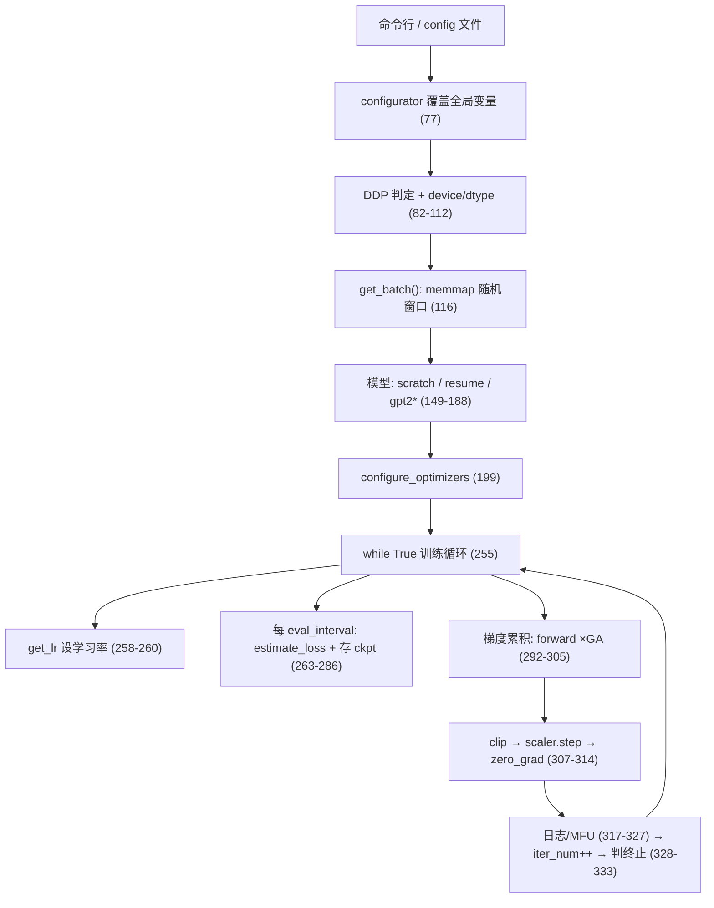

# 06 源码解读：`train.py`（336 行，训练循环全部在这）

> 一句话：`train.py` = **配置区** + **三选一的模型初始化** + **一个 `while True` 训练循环**。
> 它自己不做模型设计（那是 `model.py` 的事），只负责"喂数据、算梯度、更新权重、存 ckpt、报数字"。
>
> 引用约定：代码块为便于阅读统一**去掉了外层缩进**，部分英文注释改写成中文；需要逐字对照时以源文件为准。行号引用一律指向仓库里当前版本的 `train.py`。

## 文件结构地图

| 行号                 | 段落                | 做什么                                                       |
| ------------------ | ----------------- | --------------------------------------------------------- |
| `train.py:35-74`   | 默认配置              | 所有超参都写成**模块级全局变量**                                        |
| `train.py:76-78`   | 配置注入              | `exec(open('configurator.py').read())` 覆盖上面的全局变量          |
| `train.py:81-112`  | 运行环境              | DDP 判定、device/dtype、amp 上下文                               |
| `train.py:114-131` | 数据加载              | `get_batch()` 从 `train.bin`/`val.bin` 随机切窗口               |
| `train.py:137-144` | 读 `meta.pkl`      | 推出 `vocab_size`（133-135 是 `iter_num`/`best_val_loss` 初始化） |
| `train.py:146-193` | 模型初始化             | `init_from` 三分支 + `to(device)`                            |
| `train.py:195-212` | 优化器/编译/DDP        | GradScaler、AdamW、`torch.compile`、DDP 包装                   |
| `train.py:214-228` | `estimate_loss()` | 用 200 个 batch 估一个较稳的 loss                                 |
| `train.py:230-242` | `get_lr()`        | warmup + cosine 衰减                                        |
| `train.py:244-247` | wandb             | 可选                                                        |
| `train.py:249-333` | **训练循环**          | 设 lr → 评估存盘 → 累积梯度 → 更新 → 日志                              |
| `train.py:335-336` | 收尾                | `destroy_process_group()`                                 |



## 1. 默认配置区（`train.py:35-74`）与 `model.py` 的关系

配置区按用途分块：I/O → wandb → data → model → adamw → lr decay → DDP → system。几处值得记住的：

| 变量 | 默认值 | 说明 |
|------|--------|------|
| `eval_interval` | 2000 | 多少 iter 评估一次；字符级小数据集专用配置会调到 250 |
| `eval_iters` | 200 | 评估时抽多少个 batch 求平均 → **loss 是估计值，有采样噪声** |
| `always_save_checkpoint` | True | 为 True 则每次都存（覆盖同一个 `ckpt.pt`）；字符级配置改 False（只在 val 变好时存） |
| `init_from` | `'scratch'` | `'scratch'` / `'resume'` / `'gpt2*'` |
| `gradient_accumulation_steps` | `5*8=40` | 梯度累积（用时间换显存） |
| `batch_size` | 12 | **微批**大小；有梯度累积时显存按它算，等效批 = `batch_size × GA × world_size` |
| `block_size` | 1024 | 上下文长度，必须 ≤ `model.py` 里 `wpe` 的行数 |
| `bias` | False | 与 `GPTConfig` 的默认 True **不同**，实际以这里为准 |
| `dtype` | `bfloat16`/`float16` 自动 | 见 `train.py:73` 的条件表达式 |
| `compile` | True | PyTorch 2.0 `torch.compile`；本机/老卡要显式 `--compile=False` |

注意：`n_layer/n_head/n_embd/dropout/bias/block_size/vocab_size` 会被塞进 `model_args`（`train.py:147-148`）再构造 `GPTConfig`——**`model.py` 的 dataclass 默认值在这里基本用不到**，真正生效的是 train.py 顶部这套。

## 2. 配置注入（`train.py:76-78`）

```python
config_keys = [k for k,v in globals().items() if not k.startswith('_') and isinstance(v, (int, float, bool, str))]
exec(open('configurator.py').read()) # overrides from command line or config file
config = {k: globals()[k] for k in config_keys} # will be useful for logging
```

- `config_keys` 在 `exec` **之前**收集 → `config` 字典只包含"train.py 顶部本来就有的标量变量"。配置文件里**新引入**的变量会被 `exec` 写进 `globals()`，但不会进 `config`（也就不会进 ckpt 的 `config`、不会进 wandb）。
- `config` 这个 dict 会被存进 checkpoint（`train.py:283`），`sample.py` 正是靠它找到 `dataset` 名字去加载 `meta.pkl`（见 [`08_源码解读_sample与bench.md`](./08_源码解读_sample与bench.md)）。链路是连起来的。
- 机制细节单独一篇：[`07_源码解读_configurator.md`](./07_源码解读_configurator.md)。

## 3. DDP 判定与派生量（`train.py:81-112`）

```python
ddp = int(os.environ.get('RANK', -1)) != -1 # is this a ddp run?
if ddp:
    init_process_group(backend=backend)
    ddp_local_rank = int(os.environ['LOCAL_RANK'])
    device = f'cuda:{ddp_local_rank}'
    master_process = ddp_rank == 0
    seed_offset = ddp_rank
    assert gradient_accumulation_steps % ddp_world_size == 0
    gradient_accumulation_steps //= ddp_world_size
```

- **不靠参数开关，靠环境变量**：`torchrun` 会设置 `RANK/WORLD_SIZE/LOCAL_RANK`，所以同一份代码单卡/多卡都能跑。
- 每个进程用不同随机种子（`1337 + seed_offset`），否则所有卡抽到同样的数据窗口。
- GA 被均分到各进程：单进程累积次数变少，但全局等效 batch 不变。这里有个 **assert 要求整除**，否则直接崩。
- `master_process`（rank 0）负责打印、评估、存 ckpt。

```python
tokens_per_iter = gradient_accumulation_steps * ddp_world_size * batch_size * block_size
```

打印出来的 `tokens per iteration will be: N` 就是这个数——判断"训练量够不够"最有用的一个量（Chinchilla 之类的经验法则都按 token 数算）。

精度上下文（`train.py:109-112`）：

```python
device_type = 'cuda' if 'cuda' in device else 'cpu'
ptdtype = {'float32': torch.float32, 'bfloat16': torch.bfloat16, 'float16': torch.float16}[dtype]
ctx = nullcontext() if device_type == 'cpu' else torch.amp.autocast(device_type=device_type, dtype=ptdtype)
```

`ctx` 后面用 `with ctx:` 包住前向——CPU/MPS 是空操作（`nullcontext`），CUDA 上是自动混合精度。

## 4. 数据加载 `get_batch()`（`train.py:114-131`）

```python
def get_batch(split):
    # We recreate np.memmap every batch to avoid a memory leak, as per
    # https://stackoverflow.com/questions/45132940/...
    if split == 'train':
        data = np.memmap(os.path.join(data_dir, 'train.bin'), dtype=np.uint16, mode='r')
    else:
        data = np.memmap(os.path.join(data_dir, 'val.bin'), dtype=np.uint16, mode='r')
    ix = torch.randint(len(data) - block_size, (batch_size,))
    x = torch.stack([torch.from_numpy((data[i:i+block_size]).astype(np.int64)) for i in ix])
    y = torch.stack([torch.from_numpy((data[i+1:i+1+block_size]).astype(np.int64)) for i in ix])
    if device_type == 'cuda':
        x, y = x.pin_memory().to(device, non_blocking=True), y.pin_memory().to(device, non_blocking=True)
    else:
        x, y = x.to(device), y.to(device)
    return x, y
```

逐点解释：

- **`np.memmap`**：`train.bin` 是磁盘上的裸 `uint16` 数组，memmap 让它像内存数组一样索引、但不真读进内存（只是按需分页）。所以**几十亿 token 的数据集**（openwebtext 那份约 90 亿 token、17GB）内存占用几乎为零。
- **每 batch 重建 memmap**：源码注释里给了 StackOverflow 链接——复用一个 memmap 对象会有内存泄漏。
- `ix = torch.randint(len(data) - block_size, (batch_size,))`：随机起点，保证 `i + block_size ≤ len(data) - 1`，`y` 才够取。
- **`y` 就是 `x` 右移一位**：输入 `字符[i : i+256]`，标签 `字符[i+1 : i+257]`。模型学的是"给定前 t 个字符，预测第 t+1 个"。**这就是自监督**：不需要人工标注，文本自己既是输入又是标签。
- 窗口之间毫无关系、互相重叠——不是"一段一段切"，而是**每个 batch 随机撒 64 个窗口**。所以 `block_size=256` 并不意味着模型看到的是完整段落。
- `pin_memory()` + `non_blocking=True`：把数据放进锁页内存，让 H2D 拷贝和 GPU 计算重叠。

## 5. 从 `meta.pkl` 推 `vocab_size`（`train.py:137-144`）

```python
meta_path = os.path.join(data_dir, 'meta.pkl')
if os.path.exists(meta_path):
    with open(meta_path, 'rb') as f:
        meta = pickle.load(f)
    meta_vocab_size = meta['vocab_size']
    print(f"found vocab_size = {meta_vocab_size} (inside {meta_path})")
```

字符级数据集（含红楼梦）都产出 `meta.pkl`，所以模型词表自动对齐到 4339；BPE 数据集（openwebtext）没有 `meta.pkl`，就用 GPT-2 的 50304。日志里的 `found vocab_size = 4339 (inside data/hongloumeng/meta.pkl)` 就是这一行打的。

## 6. 三选一的模型初始化（`train.py:146-193`）

| `init_from` | 走哪段 | 干什么 |
|-------------|--------|--------|
| `scratch` | `149-157` | 全新随机初始化；`vocab_size` 取 `meta.pkl` 或 50304 |
| `resume` | `158-180` | 读 `out_dir/ckpt.pt`，恢复权重 + 优化器状态 + `iter_num` + `best_val_loss` |
| `gpt2*` | `181-188` | 从 HF 下载 GPT-2 权重（微调用） |

`resume` 里两个关键点：

```python
for k in ['n_layer', 'n_head', 'n_embd', 'block_size', 'bias', 'vocab_size']:
    model_args[k] = checkpoint_model_args[k]
...
unwanted_prefix = '_orig_mod.'
for k,v in list(state_dict.items()):
    if k.startswith(unwanted_prefix):
        state_dict[k[len(unwanted_prefix):]] = state_dict.pop(k)
```

- 结构参数**强制**用 ckpt 里的（否则权重形状对不上），只有 `dropout` 之类可以自由改。**所以改 `block_size`/`n_layer` 后再 `resume` 是无效的**——这是新手最常见的"我改了配置怎么没变"来源。
- `_orig_mod.` 前缀来自 `torch.compile` 的包装层（`train.py:208`）。注意 `raw_model = model.module if ddp else model`（`train.py:253`）只剥掉 **DDP 的 `module.` 前缀**——compile 包在 DDP 里层，所以 `compile=True` 时 `_orig_mod.` 依然会出现在 state_dict 里（源码注释自己也说这个前缀"来源不明"）。本次日志用的是 `--compile=False`，不会产生该前缀。

最后：

```python
if block_size < model.config.block_size:
    model.crop_block_size(block_size)
model.to(device)
```

从 GPT-2 权重出发想把上下文改短时才裁 `wpe`。

## 7. 优化器 / 编译 / DDP 包装（`train.py:195-212`）

```python
scaler = torch.cuda.amp.GradScaler(enabled=(dtype == 'float16'))
optimizer = model.configure_optimizers(weight_decay, learning_rate, (beta1, beta2), device_type)
if init_from == 'resume':
    optimizer.load_state_dict(checkpoint['optimizer'])
checkpoint = None # free up memory

if compile:
    unoptimized_model = model
    model = torch.compile(model)
if ddp:
    model = DDP(model, device_ids=[ddp_local_rank])
```

- GradScaler 只在 `float16` 时真正工作（`bfloat16` 不需要，`enabled=False` 就是空操作）。
- 优化器由模型自己造（`model.py:263`），因为它知道哪些参数该 decay。
- `checkpoint = None` 主动释放那份大字典（权重已经在模型里了）。
- `torch.compile` 之后拿到的是包装对象，所以后面要用 `raw_model = model.module if ddp else model`（`train.py:253`）来访问原始模型的 `estimate_mfu`。
- 顺序很重要：**先 compile 再套 DDP**。

## 8. `estimate_loss()`（`train.py:214-228`）

```python
@torch.no_grad()
def estimate_loss():
    out = {}
    model.eval()
    for split in ['train', 'val']:
        losses = torch.zeros(eval_iters)
        for k in range(eval_iters):
            X, Y = get_batch(split)
            with ctx:
                logits, loss = model(X, Y)
            losses[k] = loss.item()
        out[split] = losses.mean()
    model.train()
    return out
```

- 抽 `eval_iters=200` 个 batch 求平均，用来压住单个 batch 的抖动。**它仍然是个估计值**：200 个 batch × 每批 64 个窗口 = **12,800 个窗口**，合计 3,276,800 个 token 位置 ≈ 训练集（792,165 token）的 4.1 倍——也就是说这 200 个 batch 已经把训练集来回抽了好几遍，但**每次抽的位置不同**，所以它是一份"抽样平均"，不是全量精确值。
- `model.eval()` / `model.train()` 的切换很重要：dropout 在评估时必须关掉（`dropout=0.2` 的红楼梦模型尤其明显），否则 val loss 会被随机性污染。
- `torch.no_grad()` 省显存。
- 代价：一次评估 = 400 次前向（train+val 各 200）。日志里 `iter 5000` 那行显示耗时 **15905.84ms**——注意这个 `dt` 量的是**整个 iter 的墙钟时间**（触发了评估 + 自己还有一步前向/反向），其中评估本身约占 15.79 秒，而一个纯训练 iter 只要约 0.113 秒。`eval_iters` 不是白给的。

## 9. 学习率调度 `get_lr()`（`train.py:230-242`）

```python
def get_lr(it):
    # 1) linear warmup for warmup_iters steps
    if it < warmup_iters:
        return learning_rate * (it + 1) / (warmup_iters + 1)
    # 2) if it > lr_decay_iters, return min learning rate
    if it > lr_decay_iters:
        return min_lr
    # 3) in between, use cosine decay down to min learning rate
    decay_ratio = (it - warmup_iters) / (lr_decay_iters - warmup_iters)
    assert 0 <= decay_ratio <= 1
    coeff = 0.5 * (1.0 + math.cos(math.pi * decay_ratio)) # coeff ranges 0..1
    return min_lr + coeff * (learning_rate - min_lr)
```

（源码里的三段注释分别是 `# 1) linear warmup...`（预热）、`# 2) if it > lr_decay_iters...`（之后一直用 `min_lr`）、`# 3) in between, use cosine decay...`（余弦衰减）。）

- **warmup**：一开始学习率从接近 0 慢慢升上去，避免随机初始化的权重被一个大步长带崩。
- **cosine decay**：`coeff` 从 1 平滑降到 0，学习率从 `learning_rate` 降到 `min_lr`。
- 这个函数每个 iter 都被调用（`train.py:258`），然后把值**手动写进每个 param_group**（`train.py:259-260`）——因为 PyTorch 的 scheduler 是可选的，nanoGPT 选择手写循环。
- 经验值：`lr_decay_iters ≈ max_iters`，`min_lr ≈ learning_rate/10`。

## 10. 训练循环（`train.py:249-333`）

### 10.1 每个 iter 先定学习率（`257-260`）

```python
lr = get_lr(iter_num) if decay_lr else learning_rate
for param_group in optimizer.param_groups:
    param_group['lr'] = lr
```

### 10.2 评估 + 存 checkpoint（`262-288`）

```python
if iter_num % eval_interval == 0 and master_process:
    losses = estimate_loss()
    print(f"step {iter_num}: train loss {losses['train']:.4f}, val loss {losses['val']:.4f}")
    if losses['val'] < best_val_loss or always_save_checkpoint:
        best_val_loss = losses['val']
        if iter_num > 0:
            checkpoint = {
                'model': raw_model.state_dict(),
                'optimizer': optimizer.state_dict(),
                'model_args': model_args,
                'iter_num': iter_num,
                'best_val_loss': best_val_loss,
                'config': config,
            }
            torch.save(checkpoint, os.path.join(out_dir, 'ckpt.pt'))
if iter_num == 0 and eval_only:
    break
```

- `iter_num > 0` 这个条件意味着**第 0 步不会存盘**（初始权重没意义）；`eval_interval=250` 时第一份 ckpt 出现在 iter 250。
- `always_save_checkpoint=False`（字符级配置）时，只在 val 变好才覆盖 `ckpt.pt` → **磁盘上保存的是"历史最佳"而不是"最新"**。这一点会让人困惑："训练跑完了，采样出来怎么像中途的？"——因为后期过拟合，val 早就没再变好了。
- ckpt 里存了 `optimizer.state_dict()`（Adam 的动量）——续训时不用重新热身。
- `eval_only=True`（`config/eval_gpt2*.py` 用）：只评估一次就退出，用来测预训练模型的 loss。

### 10.3 梯度累积（`290-305`）

```python
for micro_step in range(gradient_accumulation_steps):
    if ddp:
        model.require_backward_grad_sync = (micro_step == gradient_accumulation_steps - 1)
    with ctx:
        logits, loss = model(X, Y)
        loss = loss / gradient_accumulation_steps
    X, Y = get_batch('train')   # 立刻取下一批（异步预取）
    scaler.scale(loss).backward()
```

- 显存只装得下 `batch_size` 个样本，但想要更大的等效 batch → 累积 `GA` 次梯度再更新。**loss 除以 GA** 是关键：不除的话梯度会放大 GA 倍。
- DDP 时多卡之间同步梯度很贵，所以只在**最后一个** micro step 同步（直接改 `require_backward_grad_sync`，省掉 `model.no_sync()` 的代码膨胀）。
- 注意 `X, Y = get_batch('train')` 放在了 `backward()` **之前**——让数据准备与反向计算重叠。

### 10.4 裁剪 + 更新（`306-314`）

```python
if grad_clip != 0.0:
    scaler.unscale_(optimizer)
    torch.nn.utils.clip_grad_norm_(model.parameters(), grad_clip)
scaler.step(optimizer)
scaler.update()
optimizer.zero_grad(set_to_none=True)
```

- 用 GradScaler 时必须先 `unscale_` 才能裁剪（裁剪要作用在真实梯度上）。
- `set_to_none=True` 比置 0 更省内存/更快。

### 10.5 计时、MFU、日志、终止（`316-333`）

```python
dt = t1 - t0
if iter_num % log_interval == 0 and master_process:
    lossf = loss.item() * gradient_accumulation_steps
    if local_iter_num >= 5:
        mfu = raw_model.estimate_mfu(batch_size * gradient_accumulation_steps, dt)
        running_mfu = mfu if running_mfu == -1.0 else 0.9*running_mfu + 0.1*mfu
    print(f"iter {iter_num}: loss {lossf:.4f}, time {dt*1000:.2f}ms, mfu {running_mfu*100:.2f}%")
iter_num += 1
local_iter_num += 1
if iter_num > max_iters:
    break
```

- `lossf = loss.item() * GA` 是把刚才除掉的 GA 乘回来近似"未缩放的和"——**近似**，因为最后一个 micro step 的 loss 单独乘 GA 不等于整批的平均（源码注释也承认："exact would have been a sum"）。
- MFU 用指数滑动平均（0.9 旧 + 0.1 新）平滑，且前 5 个 iter 不算（预热阶段数字难看）。
- 终止条件是 `while True` + `iter_num > max_iters`：**实际跑 `max_iters + 1` 个 iter**（iter 编号 0…max_iters）。日志最后一行是 `iter 5000`，配 `max_iters = 5000`，对得上。

## 11. 一次真实运行的数字（`logs/train-20260918-131745.log`）

配置 `config/train_hongloumeng_char.py`，参数 `--device=cuda --compile=False`，主机 `Oliver-DYS (x86_64)`，耗时 **13:17:45 → 13:31:46（约 14 分钟）**，退出码 `0`。

| 日志行 | 值 | 含义 |
|--------|-----|------|
| `tokens per iteration will be:` | 16,384 | `1(GA) × 1(world) × 64(batch) × 256(block)` |
| `found vocab_size =` | 4339 | 从 `data/hongloumeng/meta.pkl` 读出 |
| `number of parameters:` | 12.29M | 见 [`05_源码解读_model.md`](./05_源码解读_model.md) 的参数量表 |
| `step 0: train loss / val loss` | 8.4423 / 8.4390 | 随机初始化时的理论值 ≈ `ln(4339) ≈ 8.3754`，实测略高是正常的初始化噪声 |
| `iter 10 → iter 4990` | 7.55 → 1.44 | 训练 loss 持续下降 |
| `iter 10 → iter 4990` 的单步耗时 | 76.14ms → 113.12ms | 形状没变，说明是硬件状态/调度差异，不是模型变慢 |
| `step 5000: train loss / val loss` | **0.7344 / 4.6928** | 训练 loss 极低、验证 loss 高企 → **典型过拟合** |
| MFU | 5.57%（iter 10）→ 3.41%（iter 5000），过程最低 3.33%（iter 4500） | 注意分母是 A100 的 312 TFLOPS，这是折算比率 |

两个可以从这些数推出来的结论：

- **1 个 epoch = `792,165 / (64×256) ≈ 48.3` iter**；所以 5000 iter ≈ **103 个 epoch**——同一批文本被反复看了 100 多次，过拟合几乎是必然的（这正是配置里 `dropout=0.2`、`always_save_checkpoint=False` 的原因）。
- 评估很贵：`iter 5000` 那一步耗时 **15.91 秒**（含评估 + 一次训练更新），相当于 140 个普通训练 iter 的时间。

## 12. 新手踩坑清单

| 现象 | 原因 |
|------|------|
| `FileNotFoundError: data/xxx/train.bin` | 没跑 `prepare.py` |
| 改了 `block_size`/`n_layer` 但 `--init_from=resume` 后没变化 | resume 会强制用 ckpt 里的结构参数（`train.py:166-167`） |
| 采样结果像"训练中途"的模型 | `always_save_checkpoint=False` → `ckpt.pt` 只保存 val 最佳那一刻 |
| `AssertionError` on `gradient_accumulation_steps % ddp_world_size` | 多卡时 GA 必须能被卡数整除 |
| 屏幕上 `WARNING: using slow attention` | PyTorch < 2.0；装新版或接受慢速路径 |
| `torch.cuda.amp.GradScaler` FutureWarning | 新 PyTorch 的弃用提醒，不影响运行（日志里就有） |
| 损失一开始是 8.x 很大 | 正常：`ln(vocab)` 就是随机猜测的交叉熵 |

## 自测 Q&A

1. `y` 和 `x` 差在哪？→ `y` 是 `x` 在同一序列上右移一位，构成"预测下一个 token"的监督信号。
2. `batch_size=64, block_size=256, GA=1` 一次更新看多少 token？→ 16,384 个。
3. 为什么评估要抽 200 个 batch 而不是 1 个？→ 单批采样噪声大，平均后才可比。
4. `estimate_loss()` 里的 `model.eval()` 影响什么？→ 关掉 dropout，以及 Flash Attention 的 `dropout_p` 归零。
5. 训练循环实际跑多少次？→ `max_iters + 1` 次（iter 从 0 数起）。
6. 为什么先 `torch.compile` 再 DDP？→ compile 包装原始模型，DDP 负责跨卡同步；顺序颠倒会让 DDP 试图同步一个编译产物。
7. `resume` 时哪部分配置会被 ckpt 覆盖？→ `n_layer/n_head/n_embd/block_size/bias/vocab_size`。

## 相关章节

- 模型本体：[`05_源码解读_model.md`](./05_源码解读_model.md)、[`02_架构.md`](./02_架构.md)
- 数据从哪来：[`09_源码解读_数据准备.md`](./09_源码解读_数据准备.md)
- 训练配置与本机/远程脚本：[`10_源码解读_配置与脚本.md`](./10_源码解读_配置与脚本.md)
- 概念版讲解（更浅）：[`03_训练.md`](./03_训练.md)
