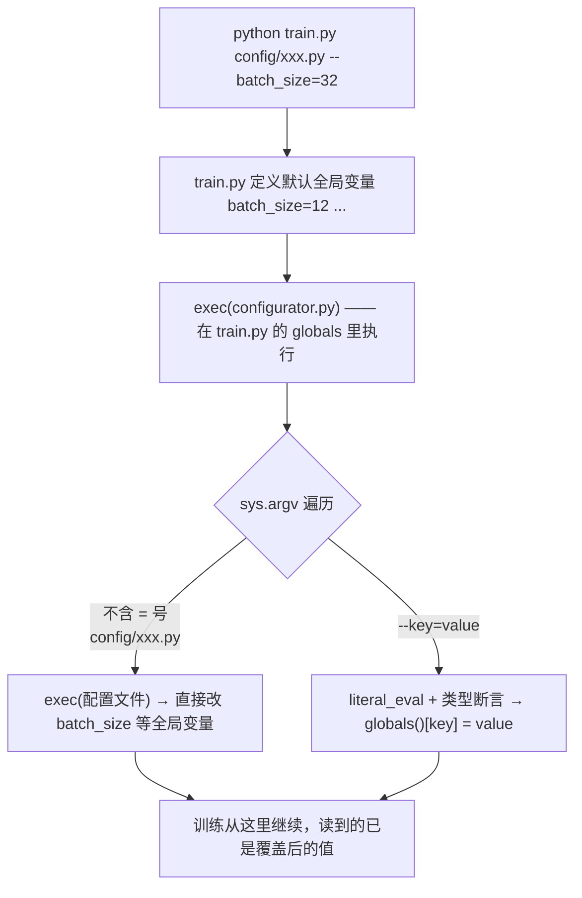

# 07 源码解读：`configurator.py`（47 行，整个仓库最"离经叛道"的文件）

> 一句话：`configurator.py` 没有函数、没有入口，只能被 `exec` 进调用者的全局命名空间——靠"改写 `globals()`"实现命令行/配置文件的配置覆盖。（它其实也能被 `import`：那样会在导入时遍历本进程的 `sys.argv` 去做覆盖，所以它不是设计来被 import 的模块。）
> 官方吐槽原文：`Poor Man's Configurator. Probably a terrible idea.` / `I know people are not going to love this`。
> 引用约定：下面的代码块为便于阅读把英文注释改写/删减成了中文；逐字对照请以 `configurator.py` 为准。

## 它是怎么被调起的（`train.py` 的三行关键代码）

`train.py` 顶部有三行配套代码；`sample.py`（第 23 行）和 `bench.py`（第 21 行）各自只有其中的 `exec` 一行——它们不需要 `config` 字典去记录/存盘：

```python
config_keys = [k for k,v in globals().items() if not k.startswith('_') and isinstance(v, (int, float, bool, str))]
exec(open('configurator.py').read()) # overrides from command line or config file
config = {k: globals()[k] for k in config_keys} # will be useful for logging
```



三个文件里 `exec` 的位置都在"默认配置定义之后、任何使用配置的代码之前"，这就是它能生效的全部原因。

## 逐行读（`configurator.py:17-47`）

```python
import sys
from ast import literal_eval

for arg in sys.argv[1:]:
    if '=' not in arg:
        # assume it's the name of a config file
        assert not arg.startswith('--')
        config_file = arg
        print(f"Overriding config with {config_file}:")
        with open(config_file) as f:
            print(f.read())
        exec(open(config_file).read())
    else:
        # assume it's a --key=value argument
        assert arg.startswith('--')
        key, val = arg.split('=')
        key = key[2:]
        if key in globals():
            try:
                attempt = literal_eval(val)   # 先试 Python 字面量
            except (SyntaxError, ValueError):
                attempt = val                 # 失败就当字符串
            assert type(attempt) == type(globals()[key])
            print(f"Overriding: {key} = {attempt}")
            globals()[key] = attempt
        else:
            raise ValueError(f"Unknown config key: {key}")
```

### 判断规则：只有两种参数

| 形态 | 判定 | 行为 |
|------|------|------|
| `config/train_gpt2.py` | **不含 `=`** | `exec` 整个文件（它自己会赋值全局变量） |
| `--batch_size=32` | **含 `=`** | 解析 `key=value` 覆盖单个变量 |
| `--batch_size` | 含 `=`？否 → 当配置文件 | 先撞上 `assert not arg.startswith('--')` 抛 AssertionError，`open` 根本不会执行 |

所以**布尔值也必须写 `--compile=False`**，不能写 `--compile` 这种 CLI flag 风格。

### `literal_eval` + 类型断言

- `literal_eval` 只认 Python 字面量：`32` → int，`6e-4` → float，`True/False` → bool。
- 认不出来就走 `except (SyntaxError, ValueError)`，原样当字符串。两种异常实测都会出现：`literal_eval('cuda:0')` 抛 `SyntaxError`（冒号不是字面量语法），`literal_eval('cpu')` 抛 `ValueError: malformed node or string`——所以 `--device=cpu` / `--device=cuda:0` 这类值最终都是靠 except 兜底成字符串的，**不是** `literal_eval` 解析出来的。（想让它真的被解析成 str，得让引号进入参数本身，例如 `--device="'cpu'"`；在 shell 里写 `--device='cpu'` 引号会被吃掉，传进去的仍是 `cpu`。）
- `assert type(attempt) == type(globals()[key])` 是**防呆**：`type` 严格比较，`int` 和 `float` 不通用。实测：

```
$ python3 -c "batch_size=12
exec(open('configurator.py').read())" --batch_size=32
Overriding: batch_size = 32          ← 正常覆盖（int → int）

$ ... --batch_size=64.0
AssertionError                        ← float 赋给 int 变量，被拦住

$ ... --nope=1
ValueError: Unknown config key: nope  ← 拼错 key 会明确报错（比 argparse 友好）

$ ... --start=a=b
ValueError: too many values to unpack (expected 2)   ← 值里不能有 = 号（split('=') 不做限制）
```

## 配置文件里为什么能用 `import` 和表达式

`exec` 是在**调用者的全局命名空间**里执行，所以配置文件就是"一段普通 Python"：

```python
# config/finetune_shakespeare.py
import time                      # ← 配置文件里可以 import
wandb_run_name = 'ft-' + str(time.time())   # ← 可以有表达式/函数调用
init_from = 'gpt2-xl'
```

这比 YAML/JSON 灵活得多（能算路径、能拼名字），代价是**配置文件会真的执行代码**——只适合跑自己写的配置，别拿去跑陌生仓库的 `config/*.py`。

## 设计权衡（为什么 Karpathy 宁愿这么写）

| 选择 | 好处 | 代价 |
|------|------|------|
| 配置就是全局变量 | 代码里直接写 `batch_size`，不用 `config.batch_size` | 全局状态，IDE 跳转/静态检查不友好 |
| 不用 argparse | 增删参数**零样板代码**，`train.py` 顶部加一行变量即完成 | 没有 `--help`、没有 `choices` 校验、没有默认值展示 |
| 配置文件 = Python | 能写表达式、能 import | 没有任何 schema 校验；执行第三方 config 有风险 |
| 严格类型断言 | 防止 `--batch_size=64.0` 这类静默错误 | `int`/`float` 不能混用，`--warmup_iters=1e3` 会报错 |

## 两个容易忽略的细节

1. **`config_keys` 在 `exec` 之前收集**（`train.py:76`）：配置文件里**新引入**的变量会被写进 `globals()` 并被后续代码用到，但**不会**进 `config` 字典（`train.py:78` 只遍历 `config_keys`）。所以它不会出现在 checkpoint 的 `config` 里、也不会进 wandb 的参数表。而 `sample.py` 恰恰依赖 `checkpoint['config']['dataset']`——如果你在配置文件里新定义一个 `dataset`（而 train.py 里本来就有这个变量，所以没问题），它照常会被记录。
2. **覆盖顺序 = 命令行从左到右**：

```bash
python train.py config/train_shakespeare_char.py --device=mps --compile=False
```
先执行配置文件，再用后面的 `--key=value` 覆盖 → 后面的赢。所以"配置里写了 device 但我命令行要改"这种需求天然支持，**不需要改配置文件**（本仓库就是这么做：`script/train-remote.sh` 在服务器上启动训练时自动追加 `--device=... --compile=...`）。

## 自测 Q&A

1. `configurator.py` 能被 `import` 吗？→ 能导入，但导入时会立刻遍历当前进程的 `sys.argv` 去覆盖变量（多带一个参数就可能抛错），所以它不是设计来被 import 的；正常用法只有 `exec` 进目标脚本的 globals。
2. `--batch_size=32` 里的 `32` 是怎么变成 int 的？→ `literal_eval` 解析字面量。
3. 命令行写 `--device=cuda:0` 会报错吗？→ 不会，`literal_eval('cuda:0')` 抛 `SyntaxError`、`literal_eval('cpu')` 抛 `ValueError`，都被 `except (SyntaxError, ValueError)` 接住后按字符串处理。
4. 配置文件里能写 `for` 循环吗？→ 能，它就是一段 Python；但别把新变量当成"配置项"（不进 `config` 字典）。
5. 参数顺序有讲究吗？→ 有：`--key=value` 覆盖它**前面**已加载的配置文件。
6. `--compile=1` 会怎样？→ `literal_eval('1')` 是 int，而 `compile` 是 bool → 类型断言失败。

## 相关章节

- 使用示例：[`06_源码解读_train.md`](./06_源码解读_train.md) 第 2 节
- 本仓库各配置文件与脚本：[`10_源码解读_配置与脚本.md`](./10_源码解读_配置与脚本.md)
