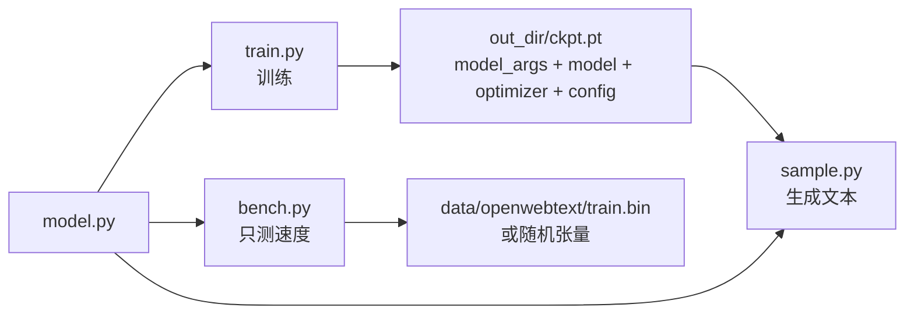

# 08 源码解读：`sample.py`（89 行）与 `bench.py`（117 行）

> 一句话：`sample.py` 是"加载 ckpt → 生成文本"的最小推理脚本；`bench.py` 是"只跑 forward/backward"的测速脚本。两者都是 `train.py` 的删减版，读它们的目的是**看清最小闭环**。
>
> 引用约定：代码块为便于阅读做了去缩进处理，部分注释有删节；逐字对照请以源文件为准。

## 一、`sample.py`

### 结构地图

| 行号 | 段落 |
|------|------|
| `sample.py:11-24` | 默认配置 + `exec(configurator)` |
| `sample.py:26-32` | 随机种子、TF32、amp 上下文 |
| `sample.py:34-54` | 加载模型（`resume` 或 `gpt2*`） |
| `sample.py:56-74` | 决定用哪套编码器（`meta.pkl` 或 tiktoken） |
| `sample.py:76-81` | 把 `start` 提示词编码成 tensor |
| `sample.py:83-89` | 循环生成 + 打印 |

### 1) 配置与 `train.py` 的差异

```python
init_from = 'resume' # either 'resume' (from an out_dir) or a gpt2 variant (e.g. 'gpt2-xl')
out_dir = 'out' # ignored if init_from is not 'resume'
start = "\n" # or "<|endoftext|>" or etc. Can also specify a file, use as: "FILE:prompt.txt"
num_samples = 10 # number of samples to draw
max_new_tokens = 500 # number of tokens generated in each sample
temperature = 0.8 # 1.0 = no change, < 1.0 = less random, > 1.0 = more random
top_k = 200 # retain only the top_k most likely tokens
```

这里**没有** `dataset`/`batch_size`/学习率之类——推理只需要"模型 + 提示词 + 3 个采样参数"。`init_from` 的取值空间也缩小了：只有 `resume` 和 `gpt2*`，没有 `scratch`（没训练过的模型采样没意义）。

### 2) 加载 ckpt（`sample.py:35-46`）

```python
ckpt_path = os.path.join(out_dir, 'ckpt.pt')
checkpoint = torch.load(ckpt_path, map_location=device)
gptconf = GPTConfig(**checkpoint['model_args'])
model = GPT(gptconf)
state_dict = checkpoint['model']
unwanted_prefix = '_orig_mod.'
for k,v in list(state_dict.items()):
    if k.startswith(unwanted_prefix):
        state_dict[k[len(unwanted_prefix):]] = state_dict.pop(k)
model.load_state_dict(state_dict)
```

**为什么结构参数要从 ckpt 里读，而不是从配置文件读？** 因为推理脚本没有 `n_layer/n_head/n_embd` 这些默认值——模型架构完全由 `checkpoint['model_args']` 决定（`train.py:280` 存进去的那份）。这就是"ckpt 是自描述文件"的设计：**换机器、换目录都不会配错结构**，只要 `out_dir` 对。

### 3) 编码器的选择（`sample.py:56-74`）——最容易踩坑的地方

```python
load_meta = False
if init_from == 'resume' and 'config' in checkpoint and 'dataset' in checkpoint['config']: # older checkpoints might not have these...
    meta_path = os.path.join('data', checkpoint['config']['dataset'], 'meta.pkl')
    load_meta = os.path.exists(meta_path)
if load_meta:
    print(f"Loading meta from {meta_path}...")
    with open(meta_path, 'rb') as f:
        meta = pickle.load(f)
    stoi, itos = meta['stoi'], meta['itos']
    encode = lambda s: [stoi[c] for c in s]
    decode = lambda l: ''.join([itos[i] for i in l])
else:
    # ok let's assume gpt-2 encodings by default
    enc = tiktoken.get_encoding("gpt2")
    encode = lambda s: enc.encode(s, allowed_special={"<|endoftext|>"})
    decode = lambda l: enc.decode(l)
```

- **字符级模型必须走 `meta.pkl` 分支**，否则 id 的含义完全不同（红楼梦词表里 `id=0` 是换行 `\n`、`id=1` 是空格，同一个 id 在 GPT-2 BPE 里代表另外的东西），输出会是乱码。
- 路径是 `data/<ckpt 里的 dataset>/meta.pkl`：`dataset` 来自 `checkpoint['config']['dataset']`（`train.py` 存的 `config` 字典）。所以**推理要在仓库根目录跑**，且数据集目录里得有 `meta.pkl`。
- 如果 ckpt 里没有 `config`（老版本存的），**或者** `data/<dataset>/meta.pkl` 文件不存在（只要 `os.path.exists` 为 False 就会退回），编码器就回退到 GPT-2 BPE（`sample.py:71` 会打印 `No meta.pkl found, assuming GPT-2 encodings...`，不是静默）→ 表现为"模型输出全是怪符号"。这是"旧的 ckpt 用不了"的真实原因。

### 4) 提示词与生成（`sample.py:76-89`）

```python
if start.startswith('FILE:'):
    with open(start[5:], 'r', encoding='utf-8') as f:
        start = f.read()
start_ids = encode(start)
x = (torch.tensor(start_ids, dtype=torch.long, device=device)[None, ...])

with torch.no_grad():
    with ctx:
        for k in range(num_samples):
            y = model.generate(x, max_new_tokens, temperature=temperature, top_k=top_k)
            print(decode(y[0].tolist()))
            print('---------------')
```

- `[None, ...]` 加一个 batch 维 → `(1, len(start))`，`generate` 要求 `(b, t)`。
- `"FILE:prompt.txt"` 是唯一的花招：从文件读提示词（跨多行提示词写起来方便）。
- `num_samples=10` 不是"一次生成 10 条"，而是**循环 10 次、每次从头生成**（每次都从同一个 prompt 出发，靠采样随机性得到不同结果）。
- 输出 `y[0].tolist()` 丢掉 batch 维，再 `decode` 成字符串。
- 默认 `start="\n"`：一个换行符作为起点；`max_new_tokens=500` 是 **token 数**（字符级模型 1 token ≈ 1 个汉字，BPE 模型 1 token ≈ 大半个英文单词）。

对红楼梦模型（`out-hongloumeng-char`）的推荐命令：

```bash
python sample.py --out_dir=out-hongloumeng-char --device=mps --compile=False \
                 --start="宝玉" --num_samples=3 --max_new_tokens=300 --temperature=0.8 --top_k=50
```

注意 `top_k`：默认 200 对 4339 的字符表来说保留了太多低概率字符，中文容易生成"看着像字但不连句"的内容，调到 30–80 通常更顺。

⚠️ 前提：`out-hongloumeng-char/ckpt.pt` 必须已经存在。本机这个目录目前是空的——ckpt 文件被同步规则 `**/*.pt` 挡住，不会从服务器同步回本机，需要先在本机训练，或手工把 `ckpt.pt` 拷回来。

## 二、`bench.py`

> 官方注释：`A much shorter version of train.py for benchmarking`。它没有真正的训练流程（不划分数据、不评估、不存 ckpt），只是循环 forward+backward+step 测速度——每步确实会执行 `optimizer.step()` 更新权重，只是没人在意结果。

| 行号 | 段落 |
|------|------|
| `bench.py:12-21` | 配置（`real_data` / `profile` 两个开关） |
| `bench.py:33-48` | 数据：真数据 或 固定随机张量 |
| `bench.py:50-64` | 模型 + 优化器 + 可选 compile |
| `bench.py:66-94` | `profile=True`：用 `torch.profiler` 出 trace |
| `bench.py:96-117` | 默认：10 步预热 + 20 步计时 |

### 1) 两种数据

```python
if real_data:
    dataset = 'openwebtext'
    data_dir = os.path.join('data', dataset)
    train_data = np.memmap(os.path.join(data_dir, 'train.bin'), dtype=np.uint16, mode='r')
    def get_batch(split):
        data = train_data # note ignore split in benchmarking script
        ...
else:
    x = torch.randint(50304, (batch_size, block_size), device=device)
    y = torch.randint(50304, (batch_size, block_size), device=device)
    get_batch = lambda split: (x, y)
```

- `real_data=True` 时读 **openwebtext**（默认值，仓库里没有这个 `train.bin` 就会报错；想跑本仓库要先改 `dataset`，或直接 `--real_data=False`）。
- `real_data=False`：**同一批随机张量反复用**，把数据加载的时间彻底排除掉，纯粹测 GPU 算力。
- `get_batch` 忽略 `split` 参数——bench 不需要验证集。

### 2) 模型与优化器

```python
gptconf = GPTConfig(
    block_size = block_size,
    n_layer = 12, n_head = 12, n_embd = 768,
    dropout = 0, # for determinism
    bias = bias,
)
```

写死 GPT-2 124M 结构（不读 `meta.pkl`，`vocab_size` 用 dataclass 默认 50304）。`dropout=0` 是为了让每次跑的耗时可比。

### 3) 两种模式

- `profile=True`：`torch.profiler.profile(...)`，`wait=5, warmup=5, active=5`，trace 写到 `./bench_log`（TensorBoard 可看）。适合"哪一层慢"。
- 默认（`else` 分支）：`for stage, num_steps in enumerate([10, 20])`——**前 10 步是预热**（CUDA 首次分配、cudnn 自动调优都在这里，所以不计入结果），后 20 步才计时：

```python
torch.cuda.synchronize()
t0 = time.time()
...
torch.cuda.synchronize()
t1 = time.time()
mfu = model.estimate_mfu(batch_size * 1 * num_steps, dt)
```

`torch.cuda.synchronize()` 是必须的：CUDA 是异步的，不同步的话 `time.time()` 量到的只是"命令入队"的时间。

⚠️ `estimate_mfu(batch_size * 1 * num_steps, dt)` 的传参写法看着奇怪，但**口径是对的**：`dt` 量的是这 `num_steps` 步的总时间，而 `estimate_mfu` 内部会把 `fwdbwd_per_iter` 乘进去再除以 `dt`，`num_steps` 正好相消，得到的就是"每步 `batch_size` 条序列"的吞吐——与 `train.py:325` 传 `batch_size * gradient_accumulation_steps` 的口径一致，可以直接比较。唯一差别是 bench 没有梯度累积，而训练日志里的等效批更大。

## 三、三个脚本的关系



一句话总结：**`train.py` 产出 ckpt，`sample.py` 消费 ckpt，`bench.py` 谁都不产出**（只打印耗时/MFU），三者共用 `model.py`。

## 自测 Q&A

1. 为什么 `sample.py` 不用指定 `n_layer`？→ 结构参数存在 ckpt 的 `model_args` 里。
2. 采样中文模型忘了 `meta.pkl` 会怎样？→ 退回 GPT-2 BPE 解码，输出乱码。
3. `num_samples=10` 是同时生成 10 条吗？→ 不是，串行循环 10 次。
4. `bench.py` 的 `real_data=False` 有什么意义？→ 排除数据读取，纯测算力。
5. `bench.py` 为什么要跑 10 步预热？→ CUDA/cudnn 的首次开销与自动调优不应计入稳态耗时。
6. `sample.py` 的 `top_k=200` 对中文小词表合适吗？→ 偏大，30–80 通常更连贯。

## 相关章节

- 生成机制原理：[`04_推理.md`](./04_推理.md)
- 模型定义：[`05_源码解读_model.md`](./05_源码解读_model.md)
- 训练循环：[`06_源码解读_train.md`](./06_源码解读_train.md)
