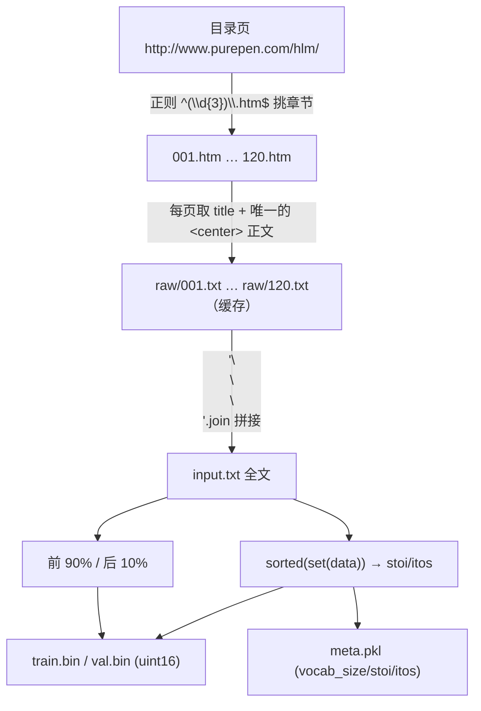

# 09 源码解读：数据准备（4 个 `prepare.py`，重点是本仓库的《红楼梦》）

> 一句话：`prepare.py` 的唯一任务是把**纯文本**变成 `train.bin` / `val.bin`（裸 `uint16` 整数流）+ `meta.pkl`（字符 ↔ id 的双向映射）。
> 理解这一层，就理解了"为什么模型眼里没有字，只有 0–4338 的整数"。

## 4 个数据集的区别（先看全局）

| 目录 | 编码方式 | 词表大小 | `prepare.py` 会写 `meta.pkl` 吗 | `train.py` 用的 `vocab_size` |
|------|----------|----------|------------------------|------------------------------|
| `data/shakespeare_char` | **字符级** | 65 | ✅（会写） | 65（读 `meta.pkl`） |
| `data/hongloumeng` | **字符级**（中文） | **4339** | ✅（会写，且仓库里已有） | **4339**（读 `meta.pkl`） |
| `data/shakespeare` | GPT-2 BPE | 50257 | ❌ | 50304（回退到 GPT-2 默认） |
| `data/openwebtext` | GPT-2 BPE + `<|endoftext|>` 分隔 | 50257 | ❌ | 50304 |

> 仓库现状：只有 `data/hongloumeng/` 真正跑过 `prepare.py`（有 `input.txt`、`raw/`、`train.bin`、`val.bin`、`meta.pkl`）；另外三个目录目前只有 `prepare.py` + `readme.md`。

`train.py:137-144` 只在 `<dataset>/meta.pkl` 存在时读它，否则打印 `defaulting to vocab_size of GPT-2 to 50304`。所以**字符级数据集必须产出 `meta.pkl`**，否则模型词表对不上、`sample.py` 也无法解码。

## 一、`data/shakespeare_char/prepare.py`（字符级的范本，68 行）

```python
# get all the unique characters that occur in this text
chars = sorted(list(set(data)))
vocab_size = len(chars)
stoi = { ch:i for i,ch in enumerate(chars) }
itos = { i:ch for i,ch in enumerate(chars) }
def encode(s):
    return [stoi[c] for c in s] # encoder: take a string, output a list of integers
def decode(l):
    return ''.join([itos[i] for i in l]) # decoder: take a list of integers, output a string
```

四步，红楼梦版完全沿用：

1. **下载/读取文本**（文件不存在才下载，已有缓存就跳过）。
2. **统计字符集**：`sorted(set(data))` → 去重后排序。排序是为了**确定性**：同一份文本永远得到同一套 id，跨机器可复现。
3. **建双向映射**：`stoi`（char→id）、`itos`（id→char）。
4. **切分 + 编码 + 落盘**：

```python
# 前面省略：下载 input.txt、读入 data、统计 chars/stoi/itos、定义 encode()

n = len(data)
train_data = data[:int(n*0.9)]
val_data = data[int(n*0.9):]

train_ids = encode(train_data)         # 先得到 Python list of int
val_ids = encode(val_data)
# 省略两行 print(...)

train_ids = np.array(train_ids, dtype=np.uint16)
val_ids = np.array(val_ids, dtype=np.uint16)
train_ids.tofile(os.path.join(os.path.dirname(__file__), 'train.bin'))
# 省略：val_ids.tofile(... 'val.bin') 与 meta.pkl 落盘
```

文件末尾的注释就是官方的实测输出（可当验收标准）：

```
# length of dataset in characters:  1115394
# all the unique characters:
#  !$&',-.3:;?ABCDEFGHIJKLMNOPQRSTUVWXYZabcdefghijklmnopqrstuvwxyz
# vocab size: 65
# train has 1003854 tokens
# val has 111540 tokens
```

几个必须记住的点：

- **`uint16` 是因为 65 < 65536**（也为了省一半磁盘）。词表超过 65535 就必须换 `uint32`（红楼梦脚本专门加了这道检查）。
- **90/10 是按字符顺序硬切的**，不是随机打散：前 90% 是训练、后 10% 是验证。所以验证集是"文本的后半段"，和训练集风格可能有偏（对小说尤其如此——后 10% 可能是后面的回目）。
- **没有 `meta.pkl` 就没法解码**：`train.bin` 里只有裸整数，谁也看不出 `37` 是哪个字。
- 字符级没有"未知词"概念：**没出现在语料里的字符，`encode` 时直接 `KeyError`**（`stoi[c]`）。

## 二、`data/shakespeare/prepare.py`（同一个文本，BPE 编码）

跟上面是同一个 `input.txt`（tinyshakespeare），但编码换成 GPT-2 BPE：

```python
enc = tiktoken.get_encoding("gpt2")
train_ids = enc.encode_ordinary(train_data)
```

- 产物只有 `train.bin` / `val.bin`，**不写 `meta.pkl`** → `train.py` 用 50304 词表，`sample.py` 用 tiktoken 解码。
- 同样一段文本（tinyshakespeare）：字符级**全文** 1,115,394 个字符（其中 train 1,003,854 + val 111,540），BPE 后 train.bin 只有 301,966 个 token——**同口径（都看 train 部分）短了约 3.3 倍**（1,003,854 ÷ 301,966 ≈ 3.3）。**BPE 把常见词合成一个 token**，序列更短，同样的 `block_size` 能覆盖更多原文、训练更快。
- `encode_ordinary` vs `encode` 的差别是真实的 API 差异：前者不解析 `<|endoftext|>` 之类的特殊 token。

## 三、`data/openwebtext/prepare.py`（大规模 BPE 语料）

这份是"能跑通 8×A100 训 GPT-2"的管道，重点在工程细节：

```python
dataset = load_dataset("openwebtext", num_proc=num_proc_load_dataset)
split_dataset = dataset["train"].train_test_split(test_size=0.0005, seed=2357, shuffle=True)
split_dataset['val'] = split_dataset.pop('test')

def process(example):
    ids = enc.encode_ordinary(example['text']) # encode_ordinary ignores any special tokens
    ids.append(enc.eot_token) # add the end of text token, e.g. 50256 for gpt2 bpe
    out = {'ids': ids, 'len': len(ids)}
    return out
```

- 数据集本身只有 `train` 划分，验证集是**自己切**出来的（`test_size=0.0005`，seed 2357）。
- 每篇文档末尾**追加一个 `eot_token`**（50256）：告诉模型"这里文档结束了，下一段和上一段无关"。字符级数据集**没有**这个机制——红楼梦全文是连续拼接的，回与回之间只是空行。
- 写入用 `np.memmap(..., mode='w+')` 分 1024 片批量灌数据（比逐条 append 快得多）。产物约 17GB / 90 亿 token（注释原文 `train.bin is ~17GB`、`train has ~9B tokens`）。

## 四、`data/hongloumeng/prepare.py`（本仓库自己写的，203 行）

数据源与结构（文件头注释）：

```
数据源：http://www.purepen.com/hlm/  （GB18030 编码，正文在唯一的 <center> 标签里）
产出：
    raw/NNN.txt        每回一个纯文本（缓存；重复运行会跳过已下载的）
    input.txt          拼接后的全文
    train.bin/val.bin  uint16 token id
    meta.pkl           vocab_size / stoi / itos
```



### 与 shakespeare_char 的差异（源码里 5 处带【修】标记 + 1 处防溢出检查）

| 位置 | 问题 | 怎么修的 |
|------|------|----------|
| `CHAPTER_RE = re.compile(r'^(\d{3})\.htm$')` | 目录页除 001–120 外还有两个 `../index.html` 导航链接，用 `base_url + link` 拼会得到站点首页并被当成一章抓 | 只用正则挑 `NNN.htm`，且先去掉 `#anchor`/`?query` |
| `ENCODING = 'gb18030'` | 服务端声明 `ISO-8859-1` 是错的，实际是 GB18030 | 每次请求后显式 `r.encoding = ENCODING`（否则 `.text` 出乱码） |
| `fetch(url, retries=3)` | 原脚本没有 `timeout`，站点一慢就永久挂住 | `timeout=20` + 3 次重试 + `time.sleep(attempt)` 退避 |
| `raw/{num:03d}.txt` | 文件名用标题会踩全角空格等字符的坑 | 用回数编号命名 |
| `c.get_text()`（不加 `strip=True`） | `strip=True` 会吃掉每个文本节点首尾空白，段首缩进就没了 | 保留换行与缩进，只统一换行、压掉 3 个以上空行 |
| `if vocab_size >= 65536: raise` | `uint16` 装不下会静默截断（id 溢出） | 超过上限直接报错并提示改 `uint32` |

另外两处工程化：**增量下载**（`os.path.exists(out_path) and not REFETCH` 就跳过，`--refetch` 强制重下）、**每章 `time.sleep(0.3)`** 做有礼貌的爬虫。

### 落盘部分与范本一致

```python
n = len(data)
train_data, val_data = data[:int(n * 0.9)], data[int(n * 0.9):]
train_ids = np.array(encode(train_data), dtype=np.uint16)
val_ids = np.array(encode(val_data), dtype=np.uint16)
train_ids.tofile(os.path.join(HERE, 'train.bin'))
val_ids.tofile(os.path.join(HERE, 'val.bin'))

with open(os.path.join(HERE, 'meta.pkl'), 'wb') as f:
    pickle.dump({'vocab_size': vocab_size, 'itos': itos, 'stoi': stoi}, f)
```

- `HERE = os.path.dirname(os.path.abspath(__file__))`：产物永远落在数据集目录里，**和你在哪个目录执行命令无关**（比 `os.path.dirname(__file__)` 更稳）。
- 脚本最后的提示：`下一步训练：python train.py config/train_hongloumeng_char.py`。

### 实测产物（本仓库现有文件，我直接读出来的）

| 项 | 值 | 怎么得到的 |
|----|-----|-----------|
| `raw/` 文件数 | **120**（`001.txt` … `120.txt`） | `os.listdir` |
| `input.txt` 字符数 | **880,184** | `len(open(...).read())` |
| 去重字符数 = `vocab_size` | **4339** | `meta.pkl` 的 `vocab_size`，与 `len(set(data))` 一致 |
| `stoi` / `itos` 条数 | 4339 / 4339 | `len()`，双向映射一一对应 |
| `train.bin` | 1,584,330 字节 → **792,165** token | 文件大小 ÷ 2（`uint16`） |
| `val.bin` | 176,038 字节 → **88,019** token | 文件大小 ÷ 2 |
| 验证集占比 | **0.1000** | 88,019 ÷ 880,184 = 10.00%，与 `int(n*0.9)` 完全吻合 |
| 回间空行 | 119 处 `\n\n\n` | 120 回拼接 → 119 个分隔符 |

`meta.pkl` 里的 id 是**按 Python 字符序（`sorted(set(data))`）排序**的，所以最小的 id 全是排版符号。我逐个打印 `itos[i]` 核对过前 20 个与最后几个：

| id | 字符 | 码位 |
|----|------|------|
| 0 | 换行 | U+000A |
| 1 | 半角空格 | U+0020 |
| 2–8 | `!` `(` `)` `,` `?` `[` `]` | U+0021 … U+005D |
| 9–10 | `·` `—` | U+00B7、U+2014 |
| 11–14 | `‘` `’` `“` `”`（中文弯引号，**不是** ASCII 的 `'` `"`） | U+2018 … U+201D |
| 15 | `…` | U+2026 |
| 16 | 全角空格（肉眼看像两个空格，实际是一个字符） | U+3000 |
| 17–19 | `、` `。` `《` | U+3001 … U+300A |
| 20 … 4190 | 汉字与常用标点（最后一个非私用区字符是 `龟`，U+9F9F） | — |
| 4191–4331 | 私用区（PUA，U+E000–U+F8FF）噪声字符，共 **141 个**（从 U+E001 到 U+E2CF） | 见左 |

最后 7 个 id（4332–4338）是 `！` `（` `）` `，` `：` `；` `？`——**全角标点因为字符序靠后，id 反而最大**，这不是"按频次排序"。

> 顺带一个真实的语料观察：4191–4331 这 **141 个**码位落在 Unicode 私用区（PUA），不是标准汉字，是抓取/编码转换时混进来的噪声字符（在 880,184 字的语料里被用到了 327 次）——这类东西只有**去读产物**才能发现，光看 `prepare.py` 是看不出来的。

## 五、本次实测：我到底跑了哪些命令

**只读测量**（没有生成/修改任何数据文件）：

```bash
# 读 meta.pkl（用标准库 pickle，不依赖 torch）
python3 -c "pickle.load(open('data/hongloumeng/meta.pkl','rb'))"   # → vocab_size=4339, stoi/itos 各 4339 条

# 读二进制大小推 token 数（uint16 → 字节数 ÷ 2）
os.path.getsize('data/hongloumeng/train.bin')   # → 1,584,330 → 792,165 tokens
os.path.getsize('data/hongloumeng/val.bin')     # → 176,038   → 88,019 tokens

# 读全文与 raw 目录
len(open('data/hongloumeng/input.txt', encoding='utf-8').read())  # → 880,184
len(os.listdir('data/hongloumeng/raw'))                           # → 120
```

**没有执行** `prepare.py`（不重新抓取、不重写 `train.bin`/`meta.pkl`），也没有跑任何训练命令。

## 自测 Q&A

1. `train.bin` 里 `37` 是什么字？→ 查 `meta.pkl['itos'][37]`；脱离 `meta.pkl` 这个数字没有意义。
2. 为什么 `train.bin` 用 `uint16`？→ 词表 4339 < 65536，省一半空间。词表更大的数据集必须换 `uint32`（脚本里有 `raise` 保护）。
3. 红楼梦训练用的验证集是哪一段？→ 全文最后 10%（第 108 回左右往后），not 随机抽样。
4. 为什么 BPE 版没有 `meta.pkl`？→ 编解码由 tiktoken 的 GPT-2 词表固定下来，不需要自建映射。
5. `raw/` 目录是干什么的？→ 逐回的原始缓存，`input.txt` 由它拼出来；有缓存就跳过下载，`--refetch` 强制重下。
6. 为什么中文词表比英文大 60 多倍？→ 字符级编码下，每个不同的汉字都要占一个 id（4339 vs 65），这直接影响 `wte` 的参数量（见 [`05_源码解读_model.md`](./05_源码解读_model.md)）。

## 相关章节

- 概念版：[`01_数据.md`](./01_数据.md)（tokenization 的两条路线、为什么用 uint16）
- 数据怎么被消费：[`06_源码解读_train.md`](./06_源码解读_train.md) 第 4、5 节
- 推理时怎么解码：[`08_源码解读_sample与bench.md`](./08_源码解读_sample与bench.md)
