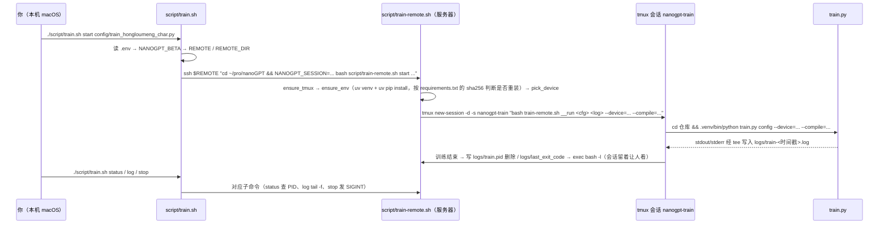

# 10 源码解读：配置文件与运行脚本（`config/` + `sync.sh` + `script/`）

> 一句话：这一层是"怎么把命令送到能跑它的人面前"——`config/*.py` 决定**训练什么**，`sync.sh` 决定**代码怎么到服务器**，`script/train.sh` + `script/train-remote.sh` 决定**训练在服务器上怎么被启动、查看、停止**。

## 一、`config/` 一览（8 个文件，都是"给 configurator 吃的 Python 片段"）

| 文件 | 用途 | 关键设置 |
|------|------|----------|
| `train_shakespeare_char.py` | 字符级英文小模型（CPU/MacBook 可跑） | 6 层/6 头/384 维、`block_size=256`、`batch_size=64`、`max_iters=5000`、`dropout=0.2` |
| `train_hongloumeng_char.py` | **本仓库新增**：字符级中文小模型 | 与上一份**结构完全相同**，只改了 `dataset`/`out_dir`/`wandb_project`（见下方 `diff`） |
| `train_gpt2.py` | 复现 GPT-2 124M（该文件注释写 8×A100 约 5 天，仓库根 `README.md` 写约 4 天） | `batch_size=12`、`block_size=1024`、`GA=5*8`、`max_iters=600000`、`wandb_log=True` |
| `eval_gpt2.py` / `_medium` / `_large` / `_xl` | 评测预训练 GPT-2 的 loss | `eval_only=True`、`eval_iters=500`、`init_from='gpt2'`（分别是 base/medium/large/xl） |
| `finetune_shakespeare.py` | 用 GPT-2-XL 微调莎士比亚 | `init_from='gpt2-xl'`、`batch_size=1` + `GA=32`、`learning_rate=3e-5`、`decay_lr=False` |

`train_shakespeare_char.py` → `train_hongloumeng_char.py` 的 diff（**压缩版**：为便于阅读略去了纯注释/空行的增删，完整结果请自己在仓库根跑 `diff`）：

```diff
- out_dir = 'out-shakespeare-char'
+ out_dir = 'out-hongloumeng-char'
- wandb_project = 'shakespeare-char'
+ wandb_project = 'hongloumeng-char'
- dataset = 'shakespeare_char'
+ dataset = 'hongloumeng'
- # baby GPT model :)
+ # baby GPT :)
```
（另有文件头注释重写、`# compile = False` 注释后多一个空格等**纯注释级**改动。）

**真正变化的赋值只有 3 个**：`out_dir`、`wandb_project`、`dataset`——"沿用超参、换数据集"是 nanoGPT 的标准玩法。结构参数一个没动，所以两个模型的参数量差异**全部来自 `wte`**（红楼梦 12.29M vs 莎士比亚 10.65M，都是 `get_num_params()` 口径，见 [`05_源码解读_model.md`](./05_源码解读_model.md)）。

几个"从 0 训练小数据"的通用经验（两个 char 配置共用）：

```python
eval_interval = 250 # keep frequent because we'll overfit
always_save_checkpoint = False   # 只在 val 变好时存 → ckpt.pt 是"历史最佳"
learning_rate = 1e-3   # 小网络可以更激进
beta2 = 0.99           # 每 iter token 数少 → 动量的二阶估计要更慢
warmup_iters = 100
```

`eval_gpt2*.py` 那四个文件都是"评一次就退出"（`eval_only=True` + `eval_iters=500` 换更稳的估计），用法：

```bash
python train.py config/eval_gpt2.py        # 会先下载 HF 的 gpt2 权重，再在 openwebtext val 上评估
```

⚠️ 它们用默认 `dataset='openwebtext'`，本地没这份 17GB 数据跑不了。

## 二、同步：`sync.sh` + `mutagen.base.yml`

`sync.sh` 是 Mutagen 的薄封装（102 行），负责"本地 ↔ 服务器"双向同步。

| 命令 | 走哪条路 | 需不需要免密 |
|------|----------|--------------|
| `./sync.sh create` | 直接 `mutagen sync create`（前台调 ssh）**密码提示能回到你的终端** | 不需要 |
| `./sync.sh start` | 拼出 `mutagen.yml` 后 `mutagen project start`（守护进程在后台连） | **必须**，否则报 `prompter not found` |
| `list` / `flush` / `pause` / `resume` / `reset` / `terminate` | 若当前目录有 `mutagen.yml` **且 `mutagen project list` 能识别到项目**，走项目子命令；否则退回单会话：`list` → `mutagen sync list`（列出全部会话，不带会话名），其余 → `mutagen sync <命令> nanogpt` | 视情况 |

两个设计细节：

```bash
# 防呆：~ 没加引号会被 bash 展开成本机家目录，远程路径就错了
case "${NANOGPT_BETA:-}" in
    *":/Users/$USER/"*) echo "警告：... ~ 被 bash 提前展开了" >&2 ;;
esac
```

```bash
# 上次没收拾干净时（会话卡住 / 手动删过 mutagen.yml），自动清掉锁再重试
if ! _out="$(mutagen project start 2>&1)"; then
    if printf '%s' "$_out" | grep -q 'already running'; then
        mutagen project terminate >/dev/null 2>&1 || true
        exec mutagen project start
    fi
fi
```

`mutagen.base.yml` 里的同步策略：`mode: "two-way-safe"`（两边都改了同一文件 → 报冲突而不是覆盖），忽略规则里最关键的三条是 **`**/*.bin`、`**/*.pkl`、`**/*.pt`**——数据集和 ckpt 都以 GB 计，绝不该来回同步（服务器上自己跑 `prepare.py` 生成）。

> 注意：忽略规则里写的是 `**/out/`（按 ignore 语法只匹配名为 `out` 的目录），本仓库自定的 `out-hongloumeng-char/` 不在其中。但**它里面的 `ckpt.pt` 会被 `**/*.pt` 挡掉**——也就是说 checkpoint 两个方向都不会同步，本机想用训练结果必须手工拷或改忽略规则。这两条结论是**按 ignore 语法推断的，还没实测**；要确认就 `./sync.sh list` 看文件数，别靠猜。

## 三、本地启动器 `script/train.sh`（289 行）

**本机执行，只负责三件事：解析地址 → 拼远端命令 → 把输出带回来。** 真正的建环境、tmux、训练全在服务器上。好处：本机断网/合盖/关终端都不影响训练。

| 子命令 | 做什么 |
|--------|--------|
| `doctor` ★ | 两步体检：先"裸探测"（`uname`/`HOME`/`SHELL`/`bash sh uv tmux python3 nvidia-smi`），再调远端脚本体检 |
| `setup-key` ★ | `ssh-copy-id` 装公钥 + `BatchMode=yes` 验证免密真的生效 |
| `setup` | 服务器上建 venv + 装依赖 |
| `prepare [dataset]` | 服务器上跑 `data/<dataset>/prepare.py`（默认 `shakespeare_char`） |
| `start [config] [参数...]` | 起 tmux 训练会话 |
| `status` / `log` / `attach` | 看状态 / `tail -f` 日志 / 进 tmux（Ctrl-b 再 d 脱离） |
| `stop` / `kill` | `SIGINT` 停训练（会话保留）/ 关掉 tmux 会话 |
| `shell` | 进服务器仓库目录开 shell |

免密的两种方式（都不把密码写进仓库）：

- **A. macOS 钥匙串**（推荐）：`security add-generic-password -a <用户> -s nanogpt-ssh -w`，然后在 `.env` 设 `NANOGPT_KEYCHAIN_SERVICE` / `NANOGPT_KEYCHAIN_ACCOUNT`。脚本用 OpenSSH 官方的 `SSH_ASKPASS` + `SSH_ASKPASS_REQUIRE=force` 钩子让 ssh 自动取密码。
- **B. 装 SSH 公钥**：`./script/train.sh setup-key`，一次之后永久免密。

⚠️ 这两种只对**本脚本发起的 ssh** 生效：注释里实测写着 Mutagen 会把 `SSH_ASKPASS` 强制指向自己，所以想让 Mutagen 也免密，只能装密钥（或给 `MUTAGEN_SSH_PATH` 一个包装过的 ssh）。

## 四、服务器端 `script/train-remote.sh`（328 行）

被本地脚本通过 ssh 调起，**不能直接 `./`**（`#!/usr/bin/env bash` 两行注释解释了原因）：

> Mutagen 同步默认用 portable 权限模式（文件 0600 / 目录 0700），到服务器上可执行位会丢，所以只能显式用 `bash script/train-remote.sh`。



几个"实测踩出来的"补丁（都写在注释里）：

```bash
# 补 PATH（两个坑都是实测踩出来的）：
#   1. uv 装在 ~/.local/bin，而非交互式 ssh 不会读 .bashrc，找不到 uv
#   2. WSL 里 nvidia-smi 只在 /usr/lib/wsl/lib，不在默认 PATH
export PATH="$HOME/.local/bin:/usr/lib/wsl/lib:$PATH"
```

```bash
# 进程替换而不是管道：$! 就是 python 自己的 PID，stop 能精确杀掉训练进程，
# 同时 tee 让 attach 上去也能实时看到输出。
"$PY" train.py "$config" "$@" > >(tee -a "$logfile") 2>&1 &
local py_pid=$!
echo "$py_pid" >"$PIDFILE"
```

设备检测（`pick_device()`）：`NANOGPT_DEVICE` 显式指定 > `nvidia-smi -L` 成功 → `cuda` > torch 报 MPS 可用 → `mps` > 否则 `cpu`。非 CUDA 时自动补 `--dtype=float32`（MPS/CPU 不走 autocast，也免掉 GradScaler 的告警）。

依赖管理用 `uv`（与你的习惯一致）：`uv venv --python 3.12 .venv` + `uv pip install -r script/requirements.txt`。是否跳过安装按**两个条件**判断：

```bash
want="$(sha256sum "$REQS" 2>/dev/null | awk '{print $1}' || shasum -a 256 "$REQS" | awk '{print $1}')"  # macOS 走 shasum
have="$(cat "$STAMP" 2>/dev/null || true)"
if [ "$want" = "$have" ] && "$PY" -c 'import torch, numpy' >/dev/null 2>&1; then
    say "依赖已就绪（跳过安装）"
```

即**哈希一致（`$VENV/.requirements.sha256` 里存的旧哈希）且虚拟环境里能 import torch/numpy** 才跳过——环境被损坏时会自动重装。

`script/requirements.txt` 的内容与理由：

```
torch>=2.3
numpy
requests       # prepare.py 下载
tiktoken       # GPT-2 BPE 编解码
beautifulsoup4 # hongloumeng/prepare.py 抓网页
# wandb 故意不装：配置里 wandb_log = False，要用再加
```

## 五、环境变量与优先级（排错时先看这张表）

| 变量 | 默认 | 作用 |
|------|------|------|
| `NANOGPT_BETA` | — | `user@host:~/path`，**sync.sh 与 train.sh 共用**（通常写在 `.env`） |
| `NANOGPT_REMOTE` / `NANOGPT_REMOTE_DIR` | 从 `NANOGPT_BETA` 拆出 / `~/pro/nanoGPT` | 分开指定 ssh 目标与远端目录（要非默认端口时用这对） |
| `NANOGPT_SESSION` | `nanogpt-train` | tmux 会话名 |
| `NANOGPT_CONFIG` | `config/train_shakespeare_char.py` | 默认配置文件 |
| `NANOGPT_DEVICE` / `NANOGPT_COMPILE` | 自动检测 / `false` | 强制设备 / 是否 `torch.compile` |
| `NANOGPT_PYTHON` | `3.12` | uv 建环境用的 Python 版本 |
| `NANOGPT_DRY_RUN=1` | 0 | **只打印要执行的 ssh 命令，不真连**（调试神器） |
| `NANOGPT_SSH_MUX=1` | 0 | 开 SSH 连接复用（一次脚本调用只问一次密码） |

优先级：**远端**遵守"ssh 显式转发的环境变量 > 同步过去的 `.env` > 内置默认值"——`train-remote.sh` 开头专门用 `_preset_*` 变量先记住转进来的值，读完 `.env` 再盖回去（因为"本地刚改的 `.env` 还没同步到远端"，本地解析出来的值更可信）。

⚠️ 本地 `script/train.sh` **没有**这层保护：它先继承你当前 shell 的环境，然后 `set -a; . ./.env` —— 所以同一个变量如果在 shell 里显式设过、`.env` 里也有，**`.env` 会盖掉 shell 里的值**（唯一例外是 `NANOGPT_REMOTE=NANOGPT_REMOTE_DIR` 这对派生变量，用的是 `:=` 写法，调用者优先）。想临时改地址，直接改 `.env` 或用命令行前缀 `NANOGPT_BETA=... ./sync.sh create`。

## 六、运行时产生的文件

| 路径 | 谁写的 | 内容 |
|------|--------|------|
| `logs/train-<YYYYmmdd-HHMMSS>.log` | `__run` 里的 `tee` | 完整训练输出（含起止时间、主机、配置、额外参数） |
| `logs/latest.log` | `cmd_start` 的 `ln -sfn` | 指向最近一次日志的符号链接（`status`/`log` 都读它） |
| `logs/train.pid` | 训练进程的 PID | `status` 判存活、`stop` 精确杀进程；进程退出即删除 |
| `logs/last_exit_code` | `__run` | 上次训练的退出码（本仓库当前是 `0`） |
| `<out_dir>/ckpt.pt` | `train.py:286` | `model` + `optimizer` + `model_args` + `iter_num` + `best_val_loss` + `config` |

本仓库现有的一次真实运行：`logs/train-20260918-131745.log`（`config/train_hongloumeng_char.py`，`--device=cuda --compile=False`，13:17:45 → 13:31:46，退出码 0）。里面的数字分析见 [`06_源码解读_train.md`](./06_源码解读_train.md) 第 11 节。

## 七、一条完整的命令长什么样

```bash
# ① 本机：把代码同步到服务器
./sync.sh create                       # 首次（会问密码）；之后 ./sync.sh flush

# ② 本机：体检 + 建环境 + 准备数据（都在服务器上执行）
./script/train.sh doctor
./script/train.sh setup
./script/train.sh prepare hongloumeng

# ③ 本机：起训练（实际跑在服务器的 tmux 里）
./script/train.sh start config/train_hongloumeng_char.py --max_iters=2000

# ④ 查看 / 停止
./script/train.sh status
./script/train.sh log                  # Ctrl-C 退出，不影响训练
./script/train.sh stop

# ⑤ 本机采样：ckpt.pt 被同步规则挡住（`**/*.pt`，按 ignore 规则推断），不会自动回到本机。
#    要么本机自己训一份，要么手工把服务器上的 ckpt 拷回来：
#    scp <user>@<host>:~/pro/nanoGPT/out-hongloumeng-char/ckpt.pt out-hongloumeng-char/
python sample.py --out_dir=out-hongloumeng-char --device=mps --compile=False --start="宝玉"
```

## 自测 Q&A

1. `./script/train-remote.sh` 为什么不能直接执行？→ Mutagen portable 模式下可执行位丢失，必须 `bash <脚本>`。
2. 本机关盖/断网，训练会停吗？→ 不会，训练在服务器的 tmux 里。
3. 为什么不能用 `./sync.sh start` 首次建会话？→ 守护进程后台连接弹不出密码提示，要先 `create`（前台）或先装密钥。
4. `--device` 是谁决定的？→ `pick_device()` 自动探测，`NANOGPT_DEVICE` 可强制；`script/train-remote.sh` 会把它作为 `--device=` 追加到 `train.py` 命令行（覆盖 config 文件里的值）。
5. `logs/latest.log` 是什么？→ 指向最近一次日志的软链接。
6. 依赖什么时候会重装？→ `script/requirements.txt` 的 sha256 与 `$VENV/.requirements.sha256` 不一致，**或者**虚拟环境里 `import torch, numpy` 失败时。
7. 数据集 `*.bin` 为什么不同步？→ 太大；服务器上自己跑 `prepare.py` 生成。

## 相关章节

- 训练循环本身：[`06_源码解读_train.md`](./06_源码解读_train.md)
- 配置覆盖机制：[`07_源码解读_configurator.md`](./07_源码解读_configurator.md)
- 数据准备：[`09_源码解读_数据准备.md`](./09_源码解读_数据准备.md)
